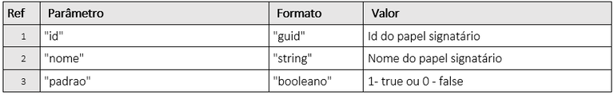

# 1.4.GET/api/v1/processo/{idProcesso}/status-do-processo

El objetivo de este método es permitir que el usuario busque el estado de un proceso de firma, para evitar buscar el proceso en su totalidad a través del método “GET/api/v1/proceso/{idproceso}” antes de que este esté con estado “Concluido”.

En este método, el usuario nos enviará el ID del Proceso, y nosotros retornaremos un JSON con el nombre y estado actual del mismo.

## Solicitud

<figure><figcaption></figcaption></figure>

### Detallamiento del Header y Parámetros

**Ref. 01:** “AppKey” es la clave de autorización para autenticarse en la API. Esta clave debe ser válida y estar vinculada a una cuenta ArqSign activa.

**Ref. 02:** “idProceso” - Para obtener el estado del proceso, debe enviarse como parámetro el Id del Proceso de firma en la plataforma ArqSign. Este ID la API lo devuelve como retorno de éxito, tras la llamada del método: **POST​/api​/v1​/processo​/enviar-documento-para-assinar.**

***

## Retorno

<figure><figcaption></figcaption></figure>

### Detallamiento del Retorno

**Ref. 01 - Código 201:** Como retorno de éxito, la aplicación retornará el código 201 junto con el nombre y el estado del proceso.

Estado del proceso:

1. Creado
2. Esperando
3. En proceso
4. Concluido
5. Cancelado


El servicio "**/api/v1/processo/{idprocesso}"** devuelve los datos del proceso y en el objeto **"signatarios.dadosAssinatura"** hay información de la firma de cada firmante.

Si está **"null"** significa que el firmante aún **no ha firmado**.

Entonces <mark style="color:red;">**null = Pendiente**</mark>

Si hay datos de la firma, significa que el firmante ha firmado.

Entonces **presencia de datos = Firmado**


**Ref. 02 - Código 400:** Mensaje de Ítem obligatorio: Este mensaje se mostrará en singular o plural cuando uno o más ítems obligatorios no hayan sido enviados en la llamada de la API.

**Ref. 03 - Código 400:** Mensaje de formato incorrecto: Este mensaje se mostrará en singular o plural cuando uno o más ítems hayan sido enviados con formato incorrecto.

**Ref. 04 - Código 400:** Mensaje de Ids inexistentes: Este mensaje se mostrará en singular o plural cuando uno o más Id enviados no existan.

**Ref. 05 - Código 400:** Mensaje de Documento excluido: Este mensaje se mostrará cuando el proceso en cuestión haya sido excluido lógicamente.

**Ref. 06 - Código 400:** Mensaje de parámetro incorrecto o inexistente: Cuando la llamada se realiza con algún parámetro escrito incorrectamente o un parámetro que no existe en el método.

**Ref. 07 - Código 401:** Mensaje de usuario de la API no autorizado: AppKey inválida o no localizada.
