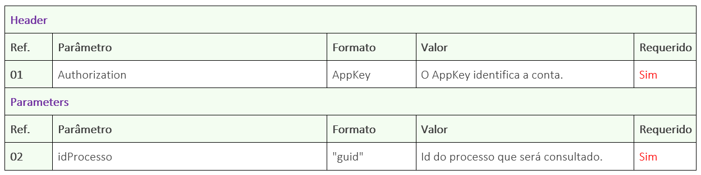
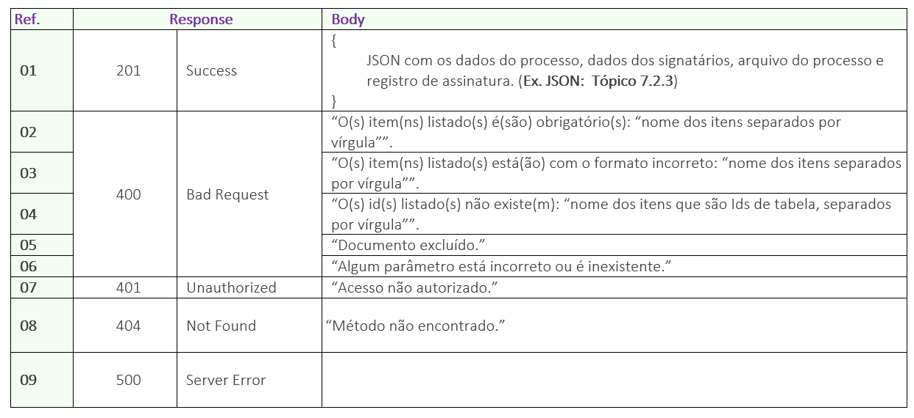

# ✔️ GET/api/v1/processo/{idprocesso}


<mark style="color:red;">Este método tiene una versión actualizada disponible para uso.</mark>

<mark style="color:red;">Si va a utilizar el método por primera vez, lo ideal es comenzar utilizando la versión más reciente, disponible en</mark> [<mark style="color:red;">**GET/api/v2/processo/{idProcesso}**</mark>](get-api-v2-processo-idprocesso.md)<mark style="color:red;">.</mark>

<mark style="color:red;">Para aquellos que ya utilizan el método en la versión 1, la funcionalidad permanece igual; lo que ocurre ahora es que esta versión no contará con nuevas funcionalidades. Cabe al cliente evaluar el uso y decidir si mantener la utilización de la versión 1 o migrar a la versión 2.</mark>


Para evitar que el método devuelva documentos aún no firmados o en proceso de firma, utilice el método de buscar el estado del proceso para verificar si el proceso en cuestión se encuentra con el estado "Concluido".

En este método, el usuario nos enviará el ID del Proceso, y nosotros devolveremos un JSON completo con la información del proceso.


<mark style="color:orange;">Es importante destacar que esta versión del servicio no busca procesos con más de un documento sin agrupamiento. Para buscar procesos con más de un documento sin agrupamiento, es necesario utilizar la versión 2 del servicio:</mark> [<mark style="color:orange;">**GET/api/v2/processo/{idProcesso}**</mark>](get-api-v2-processo-idprocesso.md)<mark style="color:orange;">.</mark>


## Requisición

<figure><figcaption><p>Haga clic en la imagen para ampliar.</p></figcaption></figure>

### Detallamiento del Header y Parámetros

**Ref. 01:** "AppKey" es la clave de autorización para autenticarse en la API. Esta clave debe ser válida y estar vinculada a una cuenta ArqSIGN activa.

Ref. 02: “idProcesso” - Para obtener los datos del proceso, debe enviarse como parámetro el ID del Proceso de firma en la plataforma ArqSIGN. Este ID es devuelto por la API como respuesta de éxito, después de la llamada al método: [**POST​/api​/v1​/processo​/enviar-documento-para-assinar**](post-api-v1-processo-enviar-documento-para-assinar.md).

***

## Retorno​

<figure><figcaption><p>Clique na imagem para ampliar.</p></figcaption></figure>

### Detallamiento de la Respuesta

**Ref. 01 - Código 201:** Como respuesta de éxito, la aplicación devolverá el código 201 junto con los datos completos del proceso en formato JSON.

**Ref. 02 - Código 400:** _Mensaje de ítem obligatorio:_ Este mensaje se mostrará en singular o plural cuando uno o más ítems obligatorios no se hayan enviado en la llamada a la API.

**Ref. 03 - Código 400:** _Mensaje de formato incorrecto_: Este mensaje se mostrará en singular o plural cuando uno o más ítems se hayan enviado con un formato incorrecto.

**Ref. 04 - Código 400:** _Mensaje de IDs inexistentes:_ Este mensaje se mostrará en singular o plural cuando uno o más IDs enviados no existan.

**Ref. 05 - Código 400:** _Mensaje de documento excluido:_ Este mensaje se mostrará cuando el proceso en cuestión haya sido excluido lógicamente.

**Ref. 06 - Código 400:** _Mensaje de parámetro incorrecto o inexistente_: Cuando la llamada se realice con algún parámetro escrito incorrectamente o un parámetro que no existe en el método.

**Ref. 07 - Código 401:** _Mensaje de usuario de la API no autorizado:_ AppKey inválida o no localizada.

### Ejemplo de JSON de Respuesta <a href="#toc112750310" id="toc112750310"></a>

**Ejemplo de Body**

```
{  
    "nomeProcesso": "string",
    "idResponsavel": "guid",
    "nomeResponsavel": "string",
    "idPasta": "guid",
    "caminhoDaPasta": "string",
    "status": "string", 
    "dataCadastro": "datetime", 
    "dataEnvio": "datetime", 
    "dataConclusao": "datetime", 
    "dataRenovacao": "datetime",
    "dataCancelamento": "datetime",
    "usuarioCancelamento": "string",
    "dataReenvio":  "datetime", 
    "dataExpiracao": "datetime",
    "expiracaoDias": "smallint",
    "avisoExpiracaoDias": "smallint",
    "lembrete":"true", 
    "frequenciaLembrete": "smallint",
    "signatarios": 
    [
        {
            "ordem":"tinyint",
            "id": "guid",
            "nome": "string",
            "email": "string",
            "telefone": "string",
            "aguardandoEnvio":"string",
            "falhaEnvio":"string",  
            "tipoAcao": "string", 
            "copiaEnviada": "string", 
            "remetente": "string", 
            "assinaturaRecusada": "string", 
            "motivoRecusa": "string",      
            "seguranca":
            {
                "codigoSeguranca": "string",
                "codigoSegurancaEmail": "string",
                "codigoSegurancaTelefone": "string"       
            },        
            "dadosAssinatura":   
            {    
"tipoAssinatura": "string", 
                "dataAssinatura": "datetime", 
                "ip": "string",
                "geoLocalizacao": "string",                
                "dadosCertificado": 
                {
                    "nome": "string",
                    "emissor": "string",
                    "validadeInicio": "string",
                    "validadeFim": "string"
                },            
                "dadoPessoaFisica": 
                {
                    "tipoDocumentoPF": "string",
                    "documetoPF": "string",
                    "nomePF": "string"

                },                
                "dadoPessoaJuridica": 
                {
                    "tipoDocumentoPJ": "string",
                    "documetoPJ": "string",
                    "nomePJ": "string"
                },            
                "anexos":
                [
                    {
                        "id": "guid",
                        "nome": "string"
                    }
                ]                
            }
        }
    ],    
    "documento":
    {
        "nomeComExtensao": "string",
        "contentType": "string",
        "documento":"string base64"
    },
    "registroAssinaturas":
    {
        "nome": "string",
        "arquivo": "string base64" 
    }
}
```

