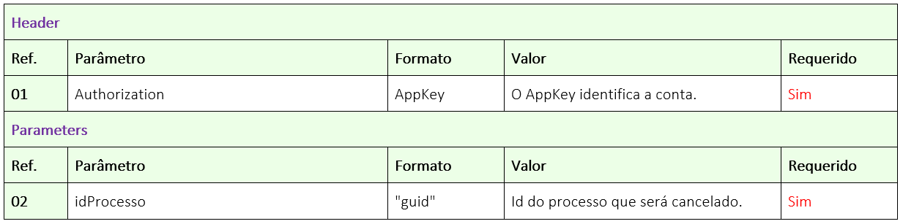
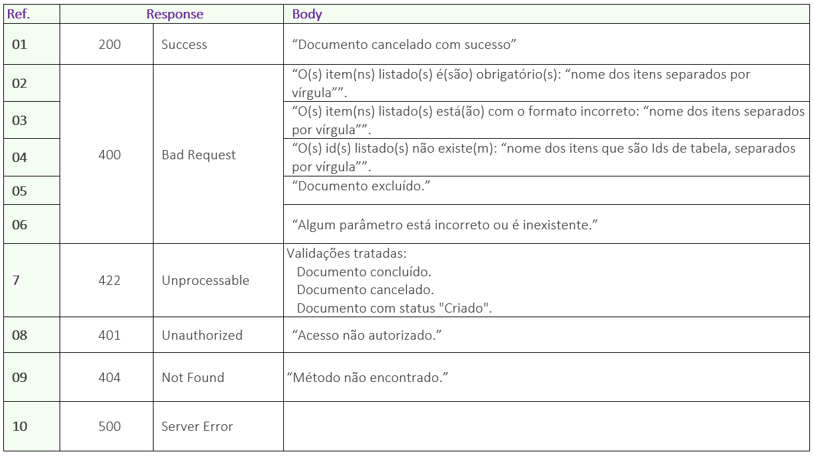

# ✔️ PATCH/api/v1/processo/{idProcesso}/cancelar-processo

El objetivo de este método es permitir que el usuario cancele el proceso de firma que esté en curso.

En este método, el usuario nos enviará el ID del Proceso, y nosotros cancelaremos el proceso informado.

## Requisición

<figure><figcaption>
Clique na imagem para ampliar.
</figcaption></figure>

***

## Retorno

<figure><figcaption>
Clique na imagem para ampliar.
</figcaption></figure>

### Detallamiento del Retorno

**Ref. 01 - Código 200:** Como retorno de éxito, la aplicación devolverá el código 200 junto con el mensaje de documento cancelado con éxito.

**Ref. 02 - Código 400:** _Mensaje de ítem obligatorio:_ Este mensaje se mostrará en singular o plural cuando uno o más ítems obligatorios no hayan sido enviados en la llamada a la API.

**Ref. 03 - Código 400:** _Mensaje de formato incorrecto:_ Este mensaje se mostrará en singular o plural cuando uno o más ítems hayan sido enviados con formato incorrecto.

**Ref. 04 - Código 400:** _Mensaje de Ids inexistentes:_ Este mensaje se mostrará en singular o plural cuando uno o más Id enviados no existan.

**Ref. 05 - Código 400:** _Mensaje de documento excluido:_ Este mensaje se mostrará cuando el proceso en cuestión haya sido excluido lógicamente.

**Ref. 06 - Código 400:** _Mensaje de parámetro incorrecto o inexistente:_ Cuando la llamada se realiza con algún parámetro escrito incorrectamente o un parámetro que no existe en el método.

**Ref. 07 - Código 422:** _Mensaje de validaciones:_ Estos mensajes se mostrarán cuando el usuario informe un estado diferente de Aguardando o Em proceso.

**Ref. 08 - Código 401:** _Mensaje de usuario de la API no autorizado:_ AppKey inválida o no localizada.
