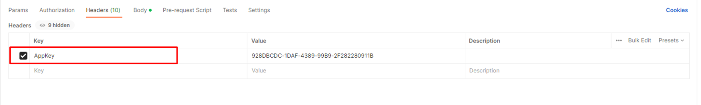

# 🔳 Requisitos para el uso de la API

1.  [<mark style="color:blue;">Acceda a su cuenta</mark>](https://app.gitbook.com/o/Ai1YjbPQxIuvTaVzoZ4H/s/KJq1WMrQrw0YrNo4VonS/) o cree una[ <mark style="color:blue;">cuenta de prueba gratuita</mark>](https://app.gitbook.com/o/Ai1YjbPQxIuvTaVzoZ4H/s/KJq1WMrQrw0YrNo4VonS/) en la Plataforma ArqSign. Después de autenticado, haga clic en el [<mark style="color:blue;">menú Integraciones y acceda a su API AppKey</mark>](../#api-key-chave-de-acesso), ID de usuario e ID de carpeta.

    <figure><figcaption></figcaption></figure>
2. Para realizar pruebas, utilice la herramienta Postman y para la autorización use el tipo AppKey.

<figure><figcaption>
Haz clic en la imagen para ampliar.
</figcaption></figure>

#### Requisitos

* Tener una cuenta activa en la plataforma ArqSign.
* Tener una clave de[ <mark style="color:blue;">acceso a la API</mark>](../#api-key-chave-de-acesso) válida, llamada AppKey.
* • Para el método [<mark style="color:blue;">**POST/api/v1/proceso/enviar-documento-para-firmar**</mark>](broken-reference), será necesario tener a mano:

&#x20;    _-> ID de un usuario de la cuenta con estado activo: para ser responsable de los documentos que se enviarán a través de la API._ &#x20;

&#x20;    _-> ID de carpeta: donde se debe almacenar el documento generado en la plataforma._

* • Para el método [<mark style="color:blue;">**POST/api/v2/proceso/enviar-documento-para-firmar**</mark>](broken-reference), será necesario:

&#x20;     _-> Cuenta activa y con permiso de Integración ArqSign._

&#x20;     _-> La cuenta debe tener créditos de Envios, SMS y/o WhatsApp, según sea necesario. Si la cuenta no tiene crédito, el sistema devolverá un mensaje de "saldo de créditos de Envios o WhatsApp o SMS insuficientes"._


<mark style="color:orange;">**La funcionalidad de**</mark> [<mark style="color:blue;">**Directorios**</mark>](../../../diretorios/documentos/) <mark style="color:orange;">**permitirá al cliente tener varias carpetas organizadoras dentro de la plataforma.**</mark>

