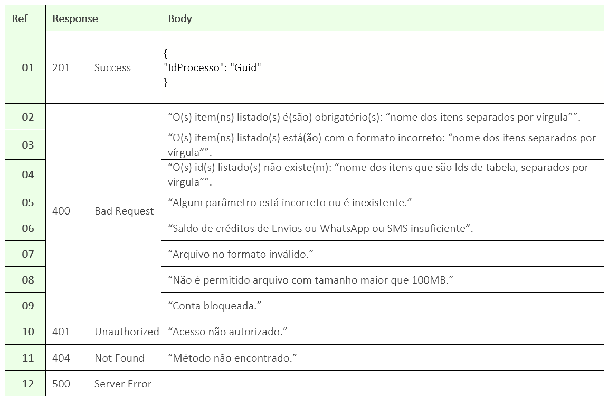

# ✔️ POST/api/v1/processo/enviar-documento-para-assinar

El objetivo de este método es permitir que el usuario envíe un documento para ser firmado a través de la plataforma ArqSIGN. En esta versión, todos los documentos enviados para firma se agrupan en un mismo PDF.


<mark style="color:red;">Este método tiene una versión actualizada disponible para su uso.</mark>

<mark style="color:red;">Si va a utilizar el método por primera vez, lo ideal es comenzar utilizando la versión más reciente, disponible en</mark> [<mark style="color:red;">**POST/api/v2/processo/enviar-documento-para-assinar**</mark>](../../metodos-disponiveis-na-api/post-api-v2-processo-enviar-documento-para-assinar.md)<mark style="color:red;">.</mark>

<mark style="color:red;">Para aquellos que ya utilizan el método en la versión 1, la funcionalidad permanece igual, aunque esta versión no contará con nuevas funcionalidades. Dependerá del cliente evaluar el uso y decidir si mantiene la utilización de la versión 1 o migra a la versión 2.</mark>

<mark style="color:red;">Consulte aquí un</mark> [<mark style="color:red;">**comparativo de información**</mark>](./#comparativo-json-v1xv2) <mark style="color:red;">que le ayudará en el proceso de migración.</mark>


## Requisición

### Ejemplo de JSON de Requisição

```
{
  "configuracoesAvancadas": {
    "tempoExpiracaoDocumentoDias": 1,
    "avisoAntesExpiracaoDocumentoDias": 1,
    "frequenciaLembretesDias": 1
  },
  "mensagemPadrao": {
    "titulo": "1",
    "texto": "1"
  },
  "destinatarios": [
    {
      "seguranca": null,
      "mensagemPersonalizada": {
        "titulo": "",
        "texto": null
      },
      "destinatariosEntradaDto": {
        "infComplNomeSignatarioObrigatorio": true,
        "infComplDocumentoSignatarioObrigatorio": true,
        "infComplRazaoSocialObrigatorio": false,
        "infComplIdentificadorObrigatorio": false,
        "idInfComplTipoDocumentoSignatarioPF": 1,
        "infComplDocumentoNomePF": "1",
        "idInfComplTipoDadosIndentificadorPF": 1,
        "infComplQtdeCaracteresPF": null,
        "idInfComplTipoDocumentoSignatarioPJ": 5,
        "infComplDocumentoNomePJ": "",
        "idInfComplTipoDadosIndentificadorPJ": null,
        "infComplQtdeCaracteresPJ": null
      },
      "anexos": [],
      "ordem": 1,
      "nome": "Nome destinatario aqui",
      "idTipoAssinatura": 1,
      "idTipoAcao": 1,
      "idFormaEnvio": 1,
      "email": "Email destinatario aqui",
      "telefone": null,
      "definirPosicaoAssinaturaAutomatica": 1
    },
    {
      "seguranca": null,
      "mensagemPersonalizada": {
        "titulo": "",
        "texto": null
      },
      "destinatariosEntradaDto": {
        "infComplNomeSignatarioObrigatorio": true,
        "infComplDocumentoSignatarioObrigatorio": true,
        "infComplRazaoSocialObrigatorio": false,
        "infComplIdentificadorObrigatorio": false,
        "idInfComplTipoDocumentoSignatarioPF": 1,
        "infComplDocumentoNomePF": "1",
        "idInfComplTipoDadosIndentificadorPF": 1,
        "infComplQtdeCaracteresPF": null,
        "idInfComplTipoDocumentoSignatarioPJ": 5,
        "infComplDocumentoNomePJ": "",
        "idInfComplTipoDadosIndentificadorPJ": null,
        "infComplQtdeCaracteresPJ": null
      },
      "anexos": [],
      "ordem": 1,
      "nome": "Nome destinatario aqui",
      "idTipoAssinatura": 1,
      "idTipoAcao": 1,
      "idFormaEnvio": 1,
      "email": "email destinatario aqui",
      "telefone": null,
      "definirPosicaoAssinaturaAutomatica": 1
    },
    {
      "seguranca": null,
      "mensagemPersonalizada": {
        "titulo": "",
        "texto": null
      },
      "destinatariosEntradaDto": {
        "infComplNomeSignatarioObrigatorio": true,
        "infComplDocumentoSignatarioObrigatorio": true,
        "infComplRazaoSocialObrigatorio": false,
        "infComplIdentificadorObrigatorio": false,
        "idInfComplTipoDocumentoSignatarioPF": 1,
        "infComplDocumentoNomePF": "1",
        "idInfComplTipoDadosIndentificadorPF": 1,
        "infComplQtdeCaracteresPF": null,
        "idInfComplTipoDocumentoSignatarioPJ": 5,
        "infComplDocumentoNomePJ": "",
        "idInfComplTipoDadosIndentificadorPJ": null,
        "infComplQtdeCaracteresPJ": null
      },
      "anexos": [],
      "ordem": 2,
      "nome": "Nome destinatario aqui",
      "idTipoAssinatura": 1,
      "idTipoAcao": 1,
      "idFormaEnvio": 1,
      "email": "Email destinatario aqui",
      "telefone": null,
      "definirPosicaoAssinaturaAutomatica": 1
    },
    {
      "seguranca": null,
      "mensagemPersonalizada": {
        "titulo": "",
        "texto": null
      },
      "destinatariosEntradaDto": {
        "infComplNomeSignatarioObrigatorio": true,
        "infComplDocumentoSignatarioObrigatorio": true,
        "infComplRazaoSocialObrigatorio": false,
        "infComplIdentificadorObrigatorio": false,
        "idInfComplTipoDocumentoSignatarioPF": 1,
        "infComplDocumentoNomePF": "1",
        "idInfComplTipoDadosIndentificadorPF": 1,
        "infComplQtdeCaracteresPF": null,
        "idInfComplTipoDocumentoSignatarioPJ": 5,
        "infComplDocumentoNomePJ": "",
        "idInfComplTipoDadosIndentificadorPJ": null,
        "infComplQtdeCaracteresPJ": null
      },
      "anexos": [],
      "ordem": 3,
      "nome": "nome destinatario aqui",
      "idTipoAssinatura": 1,
      "idTipoAcao": 1,
      "idFormaEnvio": 1,
      "email": "Email destinatario aqui",
      "telefone": null,
      "definirPosicaoAssinaturaAutomatica": 1
    },
    {
      "seguranca": null,
      "mensagemPersonalizada": {
        "titulo": "",
        "texto": null
      },
      "destinatariosEntradaDto": {
        "infComplNomeSignatarioObrigatorio": true,
        "infComplDocumentoSignatarioObrigatorio": true,
        "infComplRazaoSocialObrigatorio": false,
        "infComplIdentificadorObrigatorio": false,
        "idInfComplTipoDocumentoSignatarioPF": 1,
        "infComplDocumentoNomePF": "1",
        "idInfComplTipoDadosIndentificadorPF": 1,
        "infComplQtdeCaracteresPF": null,
        "idInfComplTipoDocumentoSignatarioPJ": 5,
        "infComplDocumentoNomePJ": "",
        "idInfComplTipoDadosIndentificadorPJ": null,
        "infComplQtdeCaracteresPJ": null
      },
      "anexos": [],
      "ordem": 5,
      "nome": "Nome do destinatário aqui",
      "idTipoAssinatura": 1,
      "idTipoAcao": 1,
      "idFormaEnvio": 1,
      "email": "Email destinatario aqui",
      "telefone": null,
      "definirPosicaoAssinaturaAutomatica": 1
    },
    {
      "seguranca": null,
      "mensagemPersonalizada": {
        "titulo": "",
        "texto": null
      },
      "destinatariosEntradaDto": {
        "infComplNomeSignatarioObrigatorio": true,
        "infComplDocumentoSignatarioObrigatorio": true,
        "infComplRazaoSocialObrigatorio": false,
        "infComplIdentificadorObrigatorio": false,
        "idInfComplTipoDocumentoSignatarioPF": 1,
        "infComplDocumentoNomePF": "1",
        "idInfComplTipoDadosIndentificadorPF": 1,
        "infComplQtdeCaracteresPF": null,
        "idInfComplTipoDocumentoSignatarioPJ": 5,
        "infComplDocumentoNomePJ": "",
        "idInfComplTipoDadosIndentificadorPJ": null,
        "infComplQtdeCaracteresPJ": null
      },
      "anexos": [],
      "ordem": 5,
      "nome": "Nome destinatario aqui",
      "idTipoAssinatura": 1,
      "idTipoAcao": 1,
      "idFormaEnvio": 1,
      "email": "Email destinatario aqui",
      "telefone": null,
      "definirPosicaoAssinaturaAutomatica": 1
    }
  ],
  "documentos": [
    {
      "arquivo": "Base64 aqui",
      "nomeComExtensao": "nomedoc.pdf"
    }
  ],
  "IdPasta" : "Id Pasta aqui",
  "renovacaoMeses": 1,
  "assinarOrdemDestinatarios": true,
  "nome": "nome arquivo aqui",
  "idResponsavel": "IdResponsavel aqui" 
}
```

<figure><figcaption></figcaption></figure>

### Detallamiento del Header y Body

**General:** Los parámetros no obligatorios que se enumeran a continuación deben estar en el JSON, y si no son necesarios para el documento, enviarlos con el valor null al lado:

&#x20;    \-> Ref. 03 “ConfiguracoesAvancadas”

&#x20;    \-> Ref. 05 “RenovacoesMeses”

&#x20;    \-> Ref. 08 “MensagemPadrão”

&#x20;    \-> Ref. 10.08 “Seguranca”

&#x20;    \-> Ref. 10.09 “mensagemPersonalizada”

&#x20;    \-> Ref. 10.10 “destinatariosEntradaDto”

&#x20;    \-> Ref. 10.11 “Anexos”

&#x20;    \-> Ref. 10.12 “definirPosicaoAssinaturaAutomatica”

&#x20;    \-> Ref. 10.13 “definirPosicaoAssinaturaManual”

**Ref. 01:** “AppKey” es la clave de autorización para autenticar en la API. Esta clave debe ser válida y estar vinculada a una cuenta activa de ArqSIGN.a.

**Ref. 03:** “ConfiguracoesAvancadas” - Las configuraciones avanzadas son un valor opcional para enviar un documento a ser firmado. Cuando esta configuración no se envía, la aplicación utiliza los valores predeterminados configurados en la cuenta.

**Ref. 03.01:** “tempoExpiracaoDocumentoDias” - es el tiempo de expiración en días para que el documento sea firmado por los firmantes. Después de este tiempo, si el documento no es firmado, expira y queda indisponible para firma.

**Ref. 03.02:** “avisoAntesExpiracaoDocumentoDias” -es el tiempo en días que la aplicación utilizará como referencia para comenzar a notificar al usuario antes de la expiración del documento.

**Ref. 03.03:** “frequenciaLembreteDias” - es la frecuencia para el envío de recordatorios a los firmantes para recordarles que firmen el documento.

**Ref. 04:** “idPasta” - es el ID de la carpeta donde el documento será almacenado dentro de la aplicación ArqSIGN.

**Ref. 05:** “renovacaoMeses” - es el tiempo en meses contados a partir de la fecha de firma del documento, que el mismo debe ser renovado, generando recordatorios de renovación para el responsable del documento.

**Ref. 06:** “assinarOrdemDestinatarios” – cuando “true”, significa que los firmantes deberán firmar el documento siguiendo un orden definido en el campo “ordem”. Cuando “false” significa que los firmantes no deberán firmar siguiendo un orden.

**Ref. 07:** “nome” - es el nombre del proceso de firma. Este nombre es la referencia de búsqueda del documento dentro de la aplicación.

**Ref. 08:** “mensagemPadrao” - es el mensaje que se enviará en la notificación a todos los firmantes que recibirán el documento para ser firmado por correo electrónico y que no tienen configuración de “mensagemPersonalizada”.

**Ref. 08. 01:** “titulo” - en este campo debe informarse el texto que será enviado como asunto del mensaje.

**Ref. 08.02:** “texto” - en este campo debe informarse el texto que será enviado como cuerpo del mensaje.

**Ref. 09:** “idResponsavel” - es el ID de un usuario activo vinculado a la cuenta en la plataforma ArqSIGN que será considerado responsable del documento que se está enviando a través de la API. Este usuario recibirá notificaciones de conclusión, rechazo de firma y recordatorios de renovación del documento, si existen.

**Ref. 10:** “Destinatarios” - en esta parte del JSON deben definirse todos los destinatarios para el documento en cuestión. Los destinatarios pueden ser personas que firmarán el documento o que recibirán una copia al final del proceso después de la firma de todos los firmantes.

**Ref. 10.01:** “ordem” – en este campo debe enviarse el orden en que el firmante firmará el documento. Este campo debe tener valor, si el campo Ref. 06 “assinarOrdemDestinatario” ha sido enviado como true. Los destinatarios configurados para recibir una copia (destinatarios del proceso que no firmarán el documento) tendrán el orden desconsiderado.

**Ref. 10.02:** “nome” – en este campo debe enviarse el nombre del destinatario.

**Ref. 10.03:** “idTipoAção” – en este campo debe definirse lo que el destinatario deberá ejecutar en el documento.

&#x20;    \-> 1 = Firmar en línea.

&#x20;    \-> 2 = Recibir una copia.

**Ref. 10.04:** “idTipoAssinatura” – en este campo debe definirse el tipo de firma del destinatario. Cuando “idTipoAção” = 1 (Firmar en línea), enviar el código de 1 a 4. Cuando “idTipoAção” = 2 (Recibir una copia), enviar el código 5.

&#x20;     \-> 1 = Firma Electrónica.

&#x20;     \-> 2 = Certificado Digital – ICP Brasil.

&#x20;     \-> 4 = Certificado Digital – Outros.

&#x20;     \-> 5 = Sin Firma.

**Ref. 10.05:** “idFormaEnvio” – en este campo debe enviarse cómo el destinatario deberá recibir el documento.

&#x20;    \-> 1 = Correo Electrónico

&#x20;    \-> 2 = WhatsApp

**Ref. 10.06:** “email” - si “idFormaEnvio” es 1 (correo electrónico), en este campo debe enviarse el correo electrónico al que el destinatario recibirá el documento.

**Ref. 10.07:** “telefone” - caso o “idFormaEnvio” seja 2 (whatsapp), en este campo debe enviarse el teléfono al que el destinatario recibirá el documento.

**Ref. 10.08:** “seguranca” - en esta parte del JSON se puede enviar un código de seguridad que el usuario debe informar al momento de firmar el documento. Vea a continuación qué información debe enviarse para que esto ocurra:

**Ref. 10.08.01:** “idMeioEnvio” - en este campo debe informarse cómo debe enviarse el código de seguridad al destinatario. Las opciones son:

&#x20;    \-> 1 = SMS **(Sólo para teléfonos de Brasil)**

&#x20;    \-> 2 = WhatsApp

&#x20;    \-> 3 = Correo Electrónico

&#x20;    \-> 4 = No enviar (Esta opción debe elegirse cuando quien está enviando el documento al destinatario informará el código de seguridad de otra forma, sin usar los medios de notificación de la plataforma ArqSIGN).

**Ref. 10.08.02:** “codigoSeguranca” - en este campo debe informarse el código de seguridad para el destinatario en cuestión.

**Ref. 10.08.03:** “codigoSegurancaEmail” - si se ha enviado en el campo “idMeioEnvio” la opción 3 = Email, se debe informar el email al cual la plataforma ArqSIGN enviará el código de seguridad.

**Ref. 10.08.04:** “codigoSegurancaTelefone” - si se ha enviado en el campo “idMeioEnvio” la opción 1 = SMS o 2 = WhatsApp, se debe informar el teléfono al cual la plataforma ArqSIGN enviará el código de seguridad.

**Ref. 10.08.05:** “reenviarCodigo” - si se ha enviado en el campo “idMeioEnvio” la opción 1 = SMS o 2 = WhatsApp, se debe informar en este campo si el destinatario, al recibir el documento para firmar, podrá solicitar el reenvío del código. Este reenvío se computará en los créditos de SMS y WhatsApp de la cuenta. Para permitir el reenvío del código, envíe la información 1 = True, para no permitir el reenvío, envíe la información 0 = False.

**Ref. 10.09:** “mensagemPersonalizada” - en esta parte del JSON se puede enviar un mensaje personalizado para el firmante en cuestión, si recibe el documento para firmar por correo electrónico.

**Ref. 10.09.01:** “titulo” - en este campo debe informarse el texto que será enviado como asunto del mensaje.

**Ref. 10.09.02:** “texto” - en este campo debe informarse el texto que será enviado como cuerpo del mensaje.

**Ref. 10.10:** “destinatariosEntradaDto” - en esta parte del JSON se deben enviar las configuraciones de datos que serán solicitados al firmante en el momento de la firma.

**Ref. 10.10.01:** “infComplNomeSignatarioObrigatorio” - envíe 1 = true para obligar al firmante a informar su nombre completo, envíe 0 = false para no obligar al firmante a informar su nombre completo.

**Ref. 10.10.02:** “infComplDocumentoSignatarioObrigatorio” - envíe 1 = true para obligar al firmante a informar un documento de identificación de PF, envíe 0 = false para no obligar al firmante a informar un documento de identificación de PF.

**Ref. 10.10.03:** “infComplRazaoSocialObrigatorio” - envíe 1 = true para obligar al firmante a informar el nombre de la empresa, envíe 0 = false para no obligar al firmante a informar el nombre de la empresa.

**Ref. 10.10.04:** “infComplIdentificadorObrigatorio”: envíe 1 = true para obligar al firmante a proporcionar un documento de identificación de persona jurídica (PJ), o envíe 0 = false para no exigir que el firmante proporcione un documento de identificación de PJ.

**Ref. 10.10.05:** “idInfComplTipoDocumentoFirmantePF” - en este campo se debe informar el tipo de documento que debe proporcionar como PF. Las opciones son:

&#x20;    \-> 1 = CPF

&#x20;    \-> 2 = CNH

&#x20;    \-> 3 = RG

&#x20;    \-> 4 = Otro

**Ref.10.10.06:** “infComplDocumentoNombrePF” - si el campo “idInfComplTipoDocumentoFirmantePF” está en el valor 4 = Otro, es necesario enviar en este campo un nombre que identificará esta opción “Otro” para el firmante en el momento de la firma.

**Ref.10.10.07:** “idInfComplTipoDatosIdentificadorPF” - cuando el campo “idInfComplTipoDocumentoFirmantePF” está en el valor 4 = Otro, es necesario enviar en este campo si el documento de PF debe ser del tipo 1 = Texto o 2 = Numérico.

**Ref.10.10.08:** “infComplCantCaracteresPF” - cuando el campo “idInfComplTipoDocumentoFirmantePF” está en el valor 4 = Otro, es necesario enviar en este campo la cantidad de caracteres para que la aplicación valide el documento de PF.

**Ref. 10.10.09:** idInfComplTipoDocumentoFirmantePJ” - en este campo se debe informar el tipo de documento que se proporcionará como PJ. Las opciones son:

&#x20;    \-> 4 = Otro

&#x20;    \-> 5 = CNPJ

**Ref.10.10.10:** “infComplDocumentoNombrePJ” - cuando el campo “idInfComplTipoDocumentoFirmantePJ” está en el valor 4 = Otro, es necesario enviar en este campo un nombre que identificará esta opción “Otro” para el firmante en el momento de la firma.

**Ref.10.10.11:** “idInfComplTipoDatosIdentificadorPJ” - cuando el campo “idInfComplTipoDocumentoFirmantePJ” está en el valor 4 = Otro, es necesario enviar en este campo si el documento de PJ debe ser del tipo 1 = Texto o 2 = Numérico.

**Ref.10.10.12:** “infComplCantCaracteresPJ” - cuando el campo “idInfComplTipoDocumentoFirmantePJ” está en el valor 4 = Otro, es necesario enviar en este campo la cantidad de caracteres para que la aplicación valide el documento de PJ.

**Ref. 10.11:** “Anexos” - en esta parte del JSON se deben enviar las configuraciones de archivos que se solicitarán a los firmantes en el momento de la firma.

**Ref. 10.11.01:** “anexoDocumentoNombre” – en este campo se debe enviar el nombre del archivo que desea que el firmante suba. Ejemplo: Frente del Documento de Identidad, Selfie, etc.

**Ref. 10.11.02:** “anexoObligatorio” - envíe 1 = true para obligar al firmante a subir este anexo o 0 = false para no obligarlo.

**Ref. 10.11.03:** “anexoMostrarTodosDestinatarios” - envíe 1 = true para que, después de completar el proceso de firma, este anexo esté disponible para todos los firmantes o envíe 0 = false para que esté disponible solo para quien envió el documento para ser firmado y para quien subió el anexo.

**Ref. 10.12:** “definirPosicionFirmaAutomatica” - en este campo se debe enviar la información si la plataforma debe o no definir automáticamente la posición de la firma para el firmante.


<mark style="color:orange;">**En el JSON, todos los destinatarios que tienen la acción de "Firmar Online" deben contar con una configuración de posicionamiento de la representación visual de la firma, ya sea de forma automática o manual. Para establecer el posicionamiento automático, la aplicación añadirá una página en blanco al final del archivo, con los espacios definidos donde firmarán todos los destinatarios. Por lo tanto, al enviar un documento para firma mediante la API, debe permitirse que la aplicación defina la posición de la firma para todos los destinatarios o para ninguno; no es posible una opción mixta (un destinatario con posicionamiento manual y otro automático).**</mark>

<mark style="color:orange;">**Así, en este campo, existen las siguientes opciones:**</mark>

* <mark style="color:orange;">**Null: enviar este parámetro como null significa que la aplicación no establecerá automáticamente el posicionamiento de la firma para los destinatarios. Será necesario, entonces, incluir los datos de posicionamiento en el JSON (definirPosicaoAssinaturaManual).**</mark>
* <mark style="color:orange;">**1 = PF: al enviar este parámetro con el valor 1, significa que la aplicación ArqSign incluirá una página al final del archivo con la definición automática de la posición de la firma del tipo Persona Física (PF).**</mark>
* <mark style="color:orange;">**2 = PJ: al enviar este parámetro con el valor 2, significa que la aplicación ArqSign incluirá una página al final del archivo con la definición automática de la posición de la firma del tipo Persona Jurídica (PJ).**</mark>
* <mark style="color:orange;">**3 = PF y PJ: al enviar este parámetro con el valor 3, significa que la aplicación ArqSign incluirá una página al final del archivo con la definición automática de la posición para dos firmas, una del tipo Persona Física (PF) y otra del tipo Persona Jurídica (PJ).**</mark>


**Ref. 10.13:** “definirPosicaoAssinaturaManual” - Esta sección del JSON debe incluir los datos de posicionamiento de la firma en el documento, siendo obligatoria si el campo definirPosicaoAssinaturaAutomatica fue enviado como “Null”.

**Ref. 10.13.01:** "pessoaFisica": si el firmante es una persona física, incluya aquí el posicionamiento de la firma.

**Ref. 10.13.01.01:** "pagina": envíe el número de la página donde debe ubicarse la firma.

**Ref. 10.13.01.02:** “Altura” - envie a altura em milímetros do tamanho da caixa onde a assinatura será aplicada.

**Ref. 10.13.01.03:** "Largura": envíe la anchura en milímetros de la caja de la firma.

**Ref. 10.13.01.04:** "PosicaoX": envíe la posición en milímetros desde el borde izquierdo de la página hasta el borde izquierdo de la caja de firma.

**Ref. 10.13.01.05:** "PosicaoY": envíe la posición en milímetros desde el borde superior de la página hasta el borde superior de la caja de firma.

**Ref. 10.13.02:** "pessoaJuridica": si el firmante es una persona jurídica, incluya aquí el posicionamiento de la firma.

**Ref. 10.13.02.01:** "pagina": envíe el número de la página donde debe ubicarse la firma.

**Ref. 10.13.02.02:** "Altura": envíe la altura en milímetros de la caja de la firma.

**Ref. 10.13.02.03:** "Largura": envíe la anchura en milímetros de la caja de la firma.

**Ref. 10.13.02.04:** "PosicaoX": envíe la posición en milímetros desde el borde izquierdo de la página hasta el borde izquierdo de la caja de firma.

**Ref. 10.13.02.05:** "PosicaoY": envíe la posición en milímetros desde el borde superior de la página hasta el borde superior de la caja de firma.La figura a continuación ilustra las medidas necesarias que deben identificarse en su modelo de documento: Altura, Anchura, Posición X y Posición Y.

<figure><figcaption></figcaption></figure>

Para saber como tirar estas medidas, assista ao vídeo abaixo:



**Ref. 11:** “Documento” - nesta parte do JSON deve ser enviado o arquivo a ser assinado. O arquivo deve ser no formato PDF limitado a 100 MB.

**Ref. 11.01:** “arquivo” - envie neste campo o arquivo em Base64.

**Ref. 11.02:** “nomeComExtensao” - envie o nome do arquivo com sua extensão.

***

## Retorno <a href="#toc112750306" id="toc112750306"></a>

<figure><figcaption><p>Clique na imagem para ampliar.</p></figcaption></figure>

### Detalhamento do Retorno

**Ref. 01 – Código 201:** Como retorno de sucesso, a aplicação retornará o código 201 e o GUID gerado para o processo. O Guid deve ser armazenado na aplicação do Cliente de forma a possibilitar a usar os métodos de GET​/api​/v1​/processo​/{idprocesso} e GET​/api​/v1​/processo​/{idProcesso}​/status-do-processo

**Ref. 02 – Código 400:** _Mensagem de item obrigatório_: Esta mensagem será exibida no singular ou plural quando um ou mais itens obrigatórios não tiver sido enviado na chamada da API.

**Ref. 03 – Código 400:** _Mensagem de formato incorreto:_ Esta mensagem será exibida no singular ou plural quando um ou mais itens estiverem sido enviados com formato incorreto.

**Ref. 04 – Código 400:** _Mensagem de Ids inexistente:_ Esta mensagem será exibida no singular ou plural quando um ou mais Id enviado não existir.

**Ref. 05 – Código 400:** _Mensagem de parâmetro incorreto ou é inexistente:_ Quando a chamada é feita com algum parâmetro escrito errado ou parâmetro que não existe no método.

**Ref. 06 – Código 400:** _Mensagem de saldo insuficiente:_ Esta mensagem será exibida quando a conta não possuir saldo suficiente para o envio por E-mail ou WhatsApp ou SMS.

**Ref. 07 – Código 400:** _Mensagem de arquivo no formato inválido:_ Esta mensagem será exibida quando o usuário informar um arquivo com extensão diferente de PDF.

**Ref. 08 – Código 400:** _Mensagem de tamanho do arquivo:_ Esta mensagem será exibida quando o usuário informar um arquivo com tamanho maior que 100MB.

**Ref. 09 - Código 400:** _Mensagem de conta bloqueada:_ Esta mensagem será exibida quando a conta estiver bloqueada.

**Ref. 10 - Código 401:** _Mensagem de usuário da API não autorizado:_ AppKey inválida ou não localizada.

***

## Comparativo JSON V1xV2

### Forma de envio&#x20;

Na **v1** era necessário informar no parâmetro “**idFormaEnvio**”, qual seria a forma de envio no processo. Agora na **V2** este parâmetro não existe. Portanto essa informação fica subentendida no sistema, quando se informa um e-mail ou telefone.

<mark style="color:red;">**V1**</mark>

<div align="left">

<figure><figcaption><p>Clique na imagem para ampliar.</p></figcaption></figure>

</div>

<mark style="color:green;">**V2**</mark>

<div align="left">

<figure><figcaption><p>Clique na imagem para ampliar.</p></figcaption></figure>

</div>


### Usar página automática&#x20;

o nome do parâmetro mudou.

<mark style="color:red;">**V1**</mark>&#x20;

<div align="left">

<figure><figcaption><p>Clique na imagem para ampliar.</p></figcaption></figure>

</div>

<mark style="color:green;">**V2**</mark>

<div align="left">

<figure><figcaption><p>Clique na imagem para ampliar.</p></figcaption></figure>

</div>

### Definição da posição de assinatura manual

Na **V2**, deve ser configurado dados de posição da assinatura manual para cada documento do processo. Portanto foi adicionado o parâmetro “**documentoDeOrdem**” dentro do objeto “**definirPosicaoAssinaturaManual**”.

<mark style="color:red;">**V1**</mark>

<div align="left">

<figure><figcaption><p>Clique na imagem para ampliar.</p></figcaption></figure>

</div>

<mark style="color:green;">**V2**</mark>

<div align="left">

<figure><figcaption><p>Clique na imagem para ampliar.</p></figcaption></figure>

</div>

### Tipo de Assinatura

Na **V1** o Tipo de Assinatura, é informado através do parâmetro “**idTipoAssinatura**” dentro do objeto de signatário.

Já na **V2**, este parâmetro se tornou uma propriedade independente (não fica dentro de nenhum objeto).

<mark style="color:red;">**V1**</mark>

<div align="left">

<figure><figcaption><p>Clique na imagem para ampliar.</p></figcaption></figure>

</div>

<mark style="color:green;">**V2**</mark>

<div align="left">

<figure><figcaption><p>Clique na imagem para ampliar.</p></figcaption></figure>

</div>

### Dados complementares&#x20;

Na **V1** os dados complementares de Pessoa Física e Jurídica eram informados dentro do objeto de Signatário por meio do parâmetro “**destinatariosEntradaDto**”. E na **V2** esses dados também se tornaram independentes e são informados no objeto "**assinaturaEletronica**".

<mark style="color:red;">**V1**</mark>

<div align="left">

<figure><figcaption><p>Clique na imagem para ampliar.</p></figcaption></figure>

</div>

<mark style="color:green;">**V2**</mark>

<div align="left">

<figure><figcaption><p>Clique na imagem para ampliar.</p></figcaption></figure>

</div>

### Documento por processo

Na **V1** é possível enviar apenas 1 documento por processo.

E na **V2** é possível enviar vários documentos em um único processo.

<mark style="color:red;">**V1**</mark>

<div align="left">

<figure><figcaption><p>Clique na imagem para ampliar.</p></figcaption></figure>

</div>

<mark style="color:green;">**V2**</mark>

<div align="left">

<figure><figcaption><p>Clique na imagem para ampliar.</p></figcaption></figure>

</div>

### Retorno da requisição

O retorno da requisição também mudou. Na **V2** é são retornados os dados de Id do processo, Id’s dos documentos e seus respectivos nomes.

<mark style="color:red;">**V1**</mark>

É retornado apenas o ID do Processo.

<mark style="color:green;">**V2**</mark>

<div align="left">

<figure><figcaption><p>Clique na imagem para ampliar.</p></figcaption></figure>

</div>
