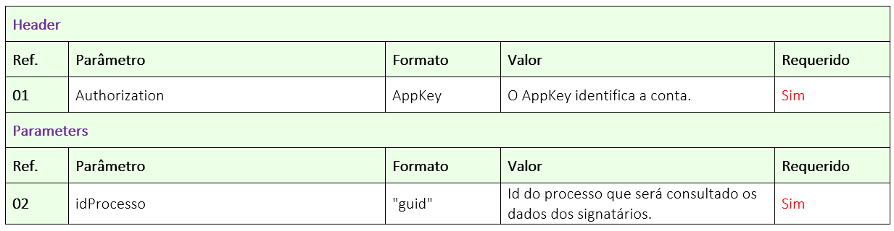

# ✔️ GET/api/v1/processo/{idprocesso}/dados-signatarios

El objetivo de este método es permitir que el usuario busque los datos de los firmantes que tienen acción de firmar electrónicamente en un proceso de firma.

En este método, el usuario nos enviará el ID del Proceso, y nosotros devolveremos un JSON completo con la información del proceso y de los firmantes.

## Requisición

<figure><figcaption><p>Clique na imagem para ampliar.</p></figcaption></figure>

### Detallamiento del Header y Parameters

**Ref. 01:** “AppKey” es la clave de autorización para autenticarse en la API. Esta clave debe ser válida y estar vinculada a una cuenta ArqSign activa.

**Ref. 02:** “idProcesso” - Para obtener el estado del proceso, debe enviarse como parámetro el ID del proceso de firma en la plataforma ArqSign. Este ID la API devuelve como respuesta de éxito, tras la llamada al método: [<mark style="color:blue;">**POST​/api​/v1​/processo​/enviar-documento-para-assinar**</mark>](../metodos-disponibles-en-la-api/post-api-v1-processo-enviar-documento-para-assinar.md).

Otra forma de obtener el ID del proceso es a través de la plataforma ArqSign, en la opción “Histórico” del documento disponible en las bandejas de [Entrada](../../../caixa-postal/caixa-de-entrada.md), [Enviados](../../../caixa-postal/enviados.md) y [Excluidos](../../../caixa-postal/excluidos.md).

***

## Retorno

<figure><figcaption><p>Clique na imagem para ampliar.</p></figcaption></figure>

### Detallamiento del Retorno

**Ref. 01 - Código 200:** Como retorno de éxito, la aplicación devolverá el código 200 junto con los datos de los firmantes del proceso en formato JSON.

**Ref. 02 - Código 400:** _Mensaje de ítem obligatorio:_ Este mensaje se mostrará en singular o plural cuando uno o más ítems obligatorios no hayan sido enviados en la llamada a la API.

**Ref. 03 - Código 400:** _Mensaje de formato incorrecto:_ Este mensaje se mostrará en singular o plural cuando uno o más ítems hayan sido enviados con un formato incorrecto.

**Ref. 04 - Código 400:** _Mensaje de IDs inexistentes:_ Este mensaje se mostrará en singular o plural cuando uno o más IDs enviados no existan.

**Ref. 05 - Código 400:** _Mensaje de documento excluido:_ Este mensaje se mostrará cuando el proceso en cuestión haya sido lógicamente excluido.

**Ref. 06 - Código 400:** _Mensaje de parámetro incorrecto o inexistente:_ Cuando la llamada se realice con algún parámetro escrito incorrectamente o parámetro que no existe en el método.

**Ref. 07 - Código 401:** Mensaje de usuario de la API no autorizado: AppKey inválida o no localizada.

### Ejemplo de JSON de Retorno

**Ejemplo Body**

```
{
    "nomeProcesso": "string",
    "status": "string",
    "dataExpiracao": "datetime",
    "signatarios": [
        {
                           "ordem":"tinyint",
            "IdProcessoDestinatario": "guid",
            "nome": "string",
            "idTipoAssinatura":"tinyint",
            "IdFormaEnvioProcesso":"bit",
            "email": "string",
            "telefone": "string",
            "tipoAcao": "string",
            "IdMeioEnvioCodigoSeguranca": "bit",
            "emailSeguranca": "string",
            "telefoneSeguranca": "string",
            "permitirReenviarCodigo": "bit",
            "falhaEnvio": "string",
            "assinado": " bit"
        }
    ]
}
```
