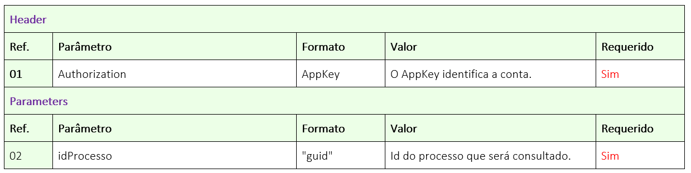
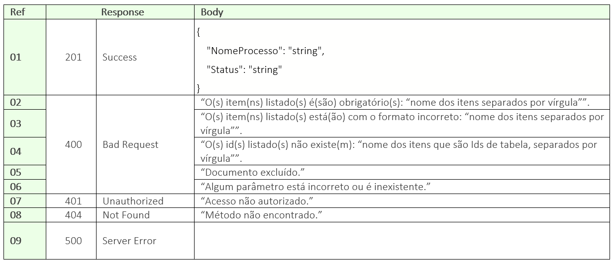

# ✔️ GET/api/v1/processo/{idProcesso}/status-do-processo

El objetivo de este método es permitir que el usuario consulte el estado de un proceso de firma, para evitar buscar el proceso en su totalidad mediante el método “GET/api/v1/processo/{idprocesso}” antes de que esté con el estado “Concluído”.

En este método, el usuario nos enviará el ID del Proceso, y nosotros devolveremos un JSON con el nombre y estado actual del mismo.

## Solicitud

<figure><figcaption>
Clique na imagem para ampliar.
</figcaption></figure>

### Detalles del Header y Parámetros

**Ref. 01:** “AppKey” es la clave de autorización para autenticarse en la API. Esta clave debe ser válida y estar vinculada a una cuenta ArqSign activa.

**Ref. 02:** “idProcesso” - Para obtener el estado del proceso, debe enviarse como parámetro el Id del Proceso de firma en la plataforma ArqSign. Este ID lo devuelve la API como respuesta exitosa, después de llamar al método: [<mark style="color:blue;">**POST​/api​/v1​/processo​/enviar-documento-para-assinar**</mark>](https://app.gitbook.com/o/Ai1YjbPQxIuvTaVzoZ4H/s/zDlPVk00J5AKVvFiB3dg/).

***

## Retorno

<figure><figcaption>
Haz clic en la imagen para ampliar.
</figcaption></figure>

### Detallamiento del Retorno

**Ref. 01 - Código 201:** Como retorno exitoso, la aplicación retornará el código 201 junto con el nombre y el estado del proceso.

Estado del proceso:

1. Creado
2. Esperando
3. En proceso
4. Concluído
5. Cancelado


El servicio "**/api/v1/processo/{idprocesso}**" devuelve los datos del proceso y en el objeto "**signatarios.dadosAssinatura**" hay información sobre la firma de cada firmante.

Si está "**null**", significa que el firmante aún **no ha firmado**.&#x20;

Entoces <mark style="color:red;">**null = Pendiente**</mark>

Si hay datos de la firma, significa que el firmante ha firmado.

Entonces, **la presencia de datos = Firmado**


**Ref. 02 - Código 400:** _Mensaje de ítem obligatorio**:**_ Este mensaje se mostrará en singular o plural cuando uno o más ítems obligatorios no se hayan enviado en la llamada a la API.

**Ref. 03 - Código 400:** _Mensaje de formato incorrecto:_ Este mensaje se mostrará en singular o plural cuando uno o más ítems se hayan enviado con formato incorrecto.

**Ref. 04 - Código 400:** _Mensaje de Ids inexistentes:_ Este mensaje se mostrará en singular o plural cuando uno o más Id enviados no existan.

**Ref. 05 - Código 400:** _Mensaje de documento excluido:_ Este mensaje se mostrará cuando el proceso en cuestión haya sido excluido lógicamente.

**Ref. 06 - Código 400:** _Mensaje de parámetro incorrecto o inexistente:_ Cuando la llamada se hace con algún parámetro mal escrito o un parámetro que no existe en el método.

**Ref. 07 - Código 401:** _Mensaje de usuario de la API no autorizado:_ AppKey inválida o no localizada.
