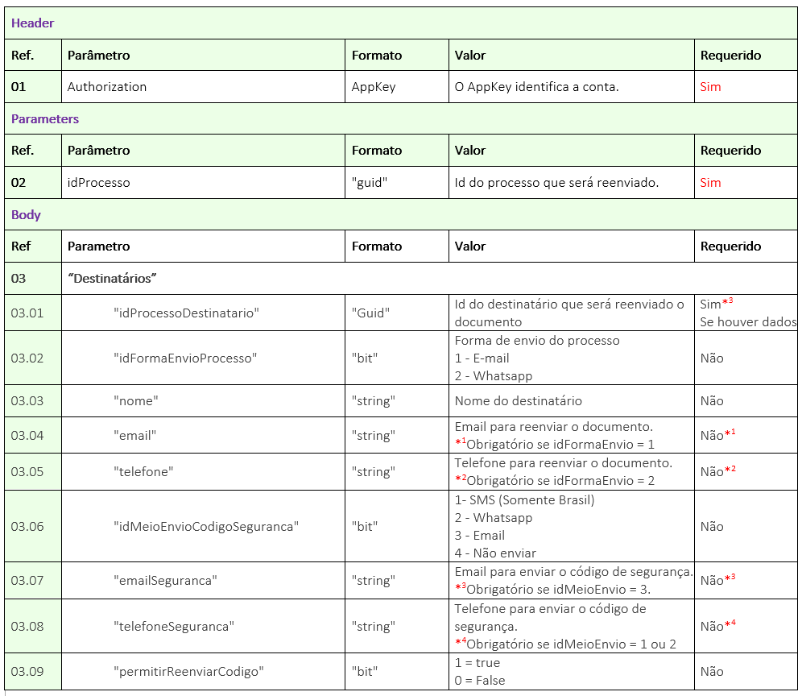
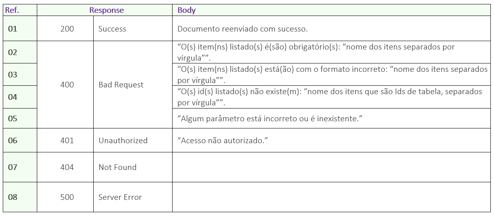

# ✔️ PATCH/api/v1/processo/{idProcesso}/reenviar-processo

El objetivo de este método es permitir que el usuario reenvíe el proceso a los destinatarios pendientes de firmas en el orden actual.

El usuario podrá informar a qué destinatario pendiente de firma desea reenviar el documento. Si no informa a los destinatarios, el servicio reenvía el proceso a todos los destinatarios participantes del proceso con acción de firmar electrónicamente y que estén pendientes de firmas en el orden actual.

Además, el usuario podrá editar los destinatarios pendientes de firma a quienes desea reenviar el proceso.

En este método, el usuario nos enviará el ID del Proceso, y nosotros reenviamos a los destinatarios pendientes de firma en el orden de firma actual, conforme a los datos informados en el JSON.

## Requisición

<figure><figcaption>
Haz clic en la imagen para ampliar.
</figcaption></figure>

**General**: Los parámetros no obligatorios que se enumeran a continuación deben estar presentes en el JSON, y si no son necesarios para el documento, se deben enviar con el valor null delante:

&#x20;    \-> Ref. 03: “Destinatarios” - Si no se informan los destinatarios, el servicio reenvía el proceso a todos los destinatarios participantes del proceso con acción de firmar en línea y que estén pendientes de firmas en el orden actual.

&#x20;    \-> Ref. 03.02 “idFormaEnvioProcesso” - se puede cambiar la forma de entrega del documento, pero no es obligatorio.

&#x20;    \-> Ref. 03.03 “nome”

&#x20;    \-> Ref. 03.06 “idMeioEnvioCodigoSeguranca” - se puede cambiar la forma de entrega tanto del código de seguridad, pero no es obligatorio.


<mark style="color:red;">**No se permite insertar un código de seguridad para destinatarios que no tienen esta configuración. Solo se permite cambiar la forma de entrega del código de seguridad para los destinatarios que ya tienen esta configuración.**</mark>


&#x20;    \-> Ref. 03.09 “permitirReenviarCodigo”

### Detallamiento del Header, Parameters y Body

**Ref. 01:** “AppKey” es la clave de autorización para autenticarse en la API. Esta clave debe ser válida y estar vinculada a una cuenta ArqSign activa.

**Ref. 02:** “idProcesso” - Para reenviar el proceso, debe enviarse como parámetro el Id del Proceso de firma en la plataforma ArqSign. Este ID lo devuelve la API como retorno de éxito, tras la llamada al método: [POST​/api​/v1​/processo​/enviar-documento-para-assinar](../metodos-disponibles-en-la-api/post-api-v1-processo-enviar-documento-para-assinar.md). Otra forma de obtener el ID del proceso es a través de la plataforma ArqSign, en la opción “Histórico” del documento disponible en las bandejas de [Entrada](../../../caixa-postal/caixa-de-entrada.md), [Enviados](../../../caixa-postal/enviados.md) y [Excluidos](../../../caixa-postal/excluidos.md).

**Ref. 03:** “Destinatarios” - en esta parte del JSON deben definirse los destinatarios a quienes se reenviará el documento, pudiendo ser modificados o no.

**Ref. 03.01:** “idProcessoDestinatario” - en este campo debe enviarse el Id del destinatario al que se reenviará el documento.

**Ref. 03.04:** “email” - cuando en el JSON, el campo “idFormaEnvio” tenga el valor 1 = E-mail, es necesario enviar en este campo la información del correo electrónico que el destinatario recibió del documento o el nuevo correo será reenviado con el documento.

**Ref. 03.05:** “telefone” - cuando en el JSON, el campo “idFormaEnvio” tenga el valor 2 = WhatsApp, es necesario enviar en este campo la información del teléfono que el destinatario recibió del documento o el nuevo teléfono será reenviado con el documento.

**Ref. 03.07:** “emailSeguranca” - cuando en el JSON, el campo “idMeioEnvioCodigoSeguranca” tenga el valor 3 = Email, es necesario enviar en este campo la información del correo electrónico que el destinatario recibió del documento o el nuevo correo será reenviado con el documento.

**Ref. 03.08:** “telefoneSeguranca” cuando en el JSON, el campo “idMeioEnvioCodigoSeguranca” tenga el valor 1 = SMS o 2 = WhatsApp, es necesario enviar en este campo la información del teléfono que el destinatario recibió del documento o el nuevo teléfono será reenviado con el documento.

***

## Retorno

<figure><figcaption>
Clique na imagem para ampliar.
</figcaption></figure>

### Detallamiento del Retorno

**Ref. 01 - Código 200:** Como retorno de éxito, la aplicación devolverá el código 200 junto con el mensaje de documento reenviado con éxito.

**Ref. 02 - Código 400:** _Mensaje de ítem obligatorio:_ Este mensaje se mostrará en singular o plural cuando uno o más ítems obligatorios no hayan sido enviados en la llamada a la API.

**Ref. 03 - Código 400:** _Mensaje de formato incorrecto:_ Este mensaje se mostrará en singular o plural cuando uno o más ítems hayan sido enviados con formato incorrecto.

**Ref. 04 - Código 400:** _Mensaje de Ids inexistentes:_ Este mensaje se mostrará en singular o plural cuando uno o más Id enviados no existan.

**Ref. 05 - Código 400:** _Mensaje de parámetro incorrecto o inexistente:_ Cuando la llamada se realiza con algún parámetro escrito incorrectamente o un parámetro que no existe en el método.

**Ref. 07 - Código 401:** _Mensaje de usuario de la API no autorizado:_ AppKey inválida o no localizada.
