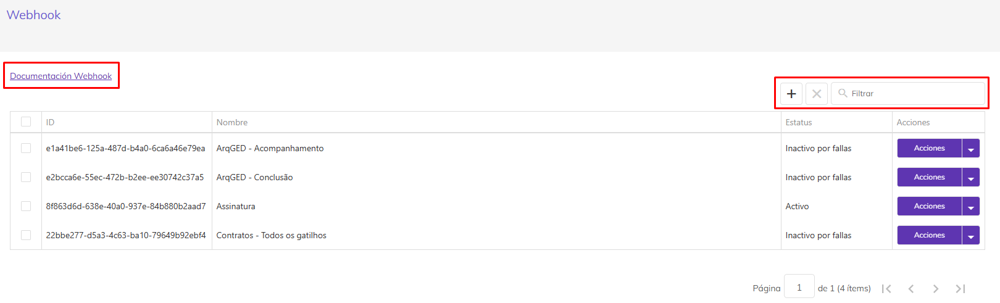

# 🟪 Webhook


<mark style="color:green;">Es una tecnología que permite la comunicación entre aplicaciones, enviando datos automáticamente entre ellas a través de HTTP. Los webhooks se activan por eventos específicos (disparadores).</mark>

<mark style="color:green;">Los webhooks son útiles para: Automatizar procesos, Mejorar el flujo de trabajo, Ahorrar recursos y costos del servidor, Integrar con servicios de terceros y otras APIs externas.</mark>

<mark style="color:green;">Los webhooks son diferentes de las APIs, que permiten la comunicación entre aplicaciones, pero funcionan de manera distinta. Una API es un conjunto de protocolos y rutinas para construir e interactuar con aplicaciones de software, mientras que un webhook es una forma de que una aplicación notifique a otra cuando ocurre un evento específico.</mark>


Este menú permite al cliente configurar Webhooks para seguir el avance de sus procesos de firmas de documentos.

<figure><figcaption>
Haga clic en la imagen para ampliar.
</figcaption></figure>

De acuerdo con la configuración de Webhook realizada, el cliente recibe los datos de ejecución de los procesos de firma a través de eventos/disparadores.


<mark style="color:blue;">Este menú se muestra a los usuarios con perfil de</mark> <mark style="color:blue;"></mark><mark style="color:blue;">**Administrador Global**</mark> <mark style="color:blue;"></mark><mark style="color:blue;">que tienen la debida autorización definida en la plataforma y con un</mark> <mark style="color:blue;"></mark><mark style="color:blue;">**plan de suscripción vigente**</mark><mark style="color:blue;">, es decir, con una</mark> <mark style="color:blue;"></mark><mark style="color:blue;">**cuenta de estado Activo**</mark><mark style="color:blue;">.</mark>


Al hacer clic en Webhook, se presenta el GRID con las configuraciones de Webhook de la cuenta del usuario que ha iniciado sesión, ordenadas alfabéticamente por la columna "Nombre".

<figure><figcaption></figcaption></figure>

**Documentación del Webhook:** Haga clic para acceder a los detalles de la configuración y uso del Webhook.

**Agregar:** Utilice para incluir una nueva configuración. Al hacer clic en el ícono "Agregar", la aplicación verifica el estado de la cuenta y la cantidad de configuraciones que tiene.


<mark style="color:orange;">Solo las</mark> <mark style="color:orange;"></mark><mark style="color:orange;">**cuentas con estado Activo**</mark> <mark style="color:orange;"></mark><mark style="color:orange;">pueden agregar configuraciones de Webhook,</mark> <mark style="color:orange;"></mark><mark style="color:orange;">**limitadas a 25 configuraciones**</mark><mark style="color:orange;">.</mark>

<mark style="color:orange;">Si la cuenta está Activa y</mark> <mark style="color:orange;"></mark><mark style="color:orange;">**tiene 25 configuraciones de webhook**</mark><mark style="color:orange;">, la aplicación muestra el mensaje:</mark> <mark style="color:orange;"></mark><mark style="color:orange;">**"La cuenta ha alcanzado el límite máximo de X configuraciones de webhook."**</mark>

<mark style="color:orange;">Si la</mark> <mark style="color:orange;"></mark><mark style="color:orange;">**Cuenta está bloqueada**</mark><mark style="color:orange;">, la aplicación muestra el mensaje:</mark> <mark style="color:orange;"></mark><mark style="color:orange;">**"La cuenta está bloqueada. Solo las cuentas con estado Activo pueden agregar configuraciones de webhook."**</mark>


**Eliminar:** Utilice para eliminar una configuración. El ícono de eliminar solo se habilita después de seleccionar una o más configuraciones de webhook con estado inactivo y que no estén siendo editadas por otro usuario.


<mark style="color:orange;">No se permite eliminar configuraciones de webhook inactivas que estén siendo editadas por otro usuario.</mark>


**Filtrar:** Utilice para filtrar configuraciones específicas. El sistema permite al usuario filtrar por datos contenidos en el resultado de la consulta del GRID y no solo en la página en cuestión.

**Nombre:** permite filtrar por el nombre del webhook.

**Estado:** permite filtrar por el estado del webhook. El sistema lista las opciones "**Activo**", "**Inactivo**" e "**Inactivo por fallas**".

<figure><figcaption></figcaption></figure>

**Columna Id**: Muestra el Id del Webhook en el sistema.

**Columna Nombre**: Muestra el nombre del Webhook en el sistema. Cuando el webhook está en edición, el sistema señala con la información <mark style="color:red;">**"En edición con: \[Nombre del usuario que está editando el webhook]".**</mark>

**Columna Estado**: Muestra el estado del webhook: **Activo**, **Inactivo** o **Inactivo por fallas**.

Cuando el estado es "**Activo**", puede tener las siguientes flags:

* **Gatillo Inactivo**: Cuando al menos un gatillo de la configuración está inactivo debido a fallas recurrentes.
* **Fallo en Gatillo**: Cuando no hay gatillos inactivos en la configuración, pero al menos un gatillo tiene una cantidad de fallas mayor que cero.

**Columna Acciones**: Este botón se muestra:

* Deshabilitado para configuraciones de webhook con la flag "En edición" por otro usuario.
* Habilitado para configuraciones de webhook sin la flag "En edición" por el usuario conectado.

Cuando está habilitado, el sistema lista las acciones, según el estado del webhook: Activar, Editar, Eliminar, Inactivar.

* **Activar**: solo para configuraciones de webhook con estado Inactivo.
* **Editar**: listada para todos los webhooks.
* **Eliminar**: solo para configuraciones de webhook con estado Inactivo.
* **Inactivar**: solo para configuraciones de webhook con estado Activo.

## Configuraciones de Webhook

Al hacer clic en Agregar "+", se presenta la pantalla para la configuración del webhook.

<figure><figcaption></figcaption></figure>

## Datos Generales

Los datos generales del webhook deben ser informados en esta área:

<figure><figcaption></figcaption></figure>

**Estado**: Se muestran en la lista las opciones "Activo" e "Inactivo", siendo por defecto la opción "Activo".


<mark style="color:blue;">En la visualización/edición de un webhook ya creado, si su estado es "Inactivo por fallas", se abrirá en la pantalla de configuraciones con el estado "Inactivo".</mark>


**Nombre**: Informe el nombre del webhook. Este es un campo de llenado obligatorio. El sistema no permite webhooks con el mismo nombre en la misma cuenta.

**URL para publicar**: Informe la URL que se llamará para recibir los datos del proceso de firma de los documentos. Este es un campo de llenado obligatorio.

**Esperar retorno**: Defina si el webhook debe esperar un retorno. Este es un campo de llenado opcional.


<mark style="color:blue;">Marcar este campo hará que el webhook espere una confirmación de su listener (URL para publicar) después de enviar un mensaje. El webhook registra una transferencia de mensajes exitosa cuando el listener retorna un código de estado HTTP 200. Si esta opción no está marcada y el webhook no recibe un código de estado HTTP 200, la aplicación no considerará esto como una falla.</mark>


## Ejecutar el webhook cuando

En esta área se deben definir los requisitos previos para la ejecución del webhook.

<figure><figcaption></figcaption></figure>

## Agregar Grupos y Usuarios

Esta opción se utiliza para configurar uno o más grupos y/o usuarios como parámetros de ejecución del webhook. Es decir, el webhook solo se ejecutará si el remitente del proceso es un usuario seleccionado o si forma parte de un grupo configurado en este campo. Este es un campo de llenado opcional.


<mark style="color:red;">Si uno de los grupos listados ha sido excluido posteriormente, se mostrará en rojo. Si uno de los usuarios listados ha sido inactivado, bloqueado o ha dejado de ser administrador global posteriormente, también se mostrará en rojo.</mark>


<figure><figcaption></figcaption></figure>

Del lado derecho de la pantalla se presentan los "Grupos" y los "Usuarios" disponibles para selección. Del lado izquierdo de la pantalla se muestran los "Grupos" y los "Usuarios" ya seleccionados.

<figure><figcaption></figcaption></figure>

Utilice los botones disponibles, haga clic sobre el nombre del grupo o del usuario que desea mover y luego haga clic en los botones para "Agregar", para enviar uno por uno, o "Agregar todos" para enviar la lista completa. Lo mismo debe hacerse para "Eliminar" elementos de la lista.

Una vez completada la selección de usuarios y grupos, haga clic en "Seleccionar" para regresar a la pantalla anterior.

<figure><figcaption></figcaption></figure>


<mark style="color:green;">Las configuraciones realizadas se mostrarán en el campo</mark> <mark style="color:green;"></mark><mark style="color:green;">**"El proceso haya sido enviado por algún usuario del grupo o usuario seleccionado en este campo"**</mark><mark style="color:green;">, que se verifica para la</mark> <mark style="color:green;"></mark><mark style="color:green;">**"Ejecución del webhook"**</mark><mark style="color:green;">.</mark>


### **Agregar carpetas**

Esta opción se utiliza para configurar una o más carpetas como parámetro de ejecución del webhook. Es decir, el webhook solo se ejecutará si el proceso fue creado en alguna carpeta incluida en este campo. En este campo se mostrarán las carpetas seleccionadas en el modal "Carpetas". Este es un campo opcional.

<figure><figcaption></figcaption></figure>

Seleccione en el árbol la carpeta en la que desea limitar la ejecución del webhook. En el campo "Carpetas seleccionadas" se enumerarán todas las carpetas marcadas. Haga clic en "Seleccionar" para finalizar la configuración.


<mark style="color:red;">Si alguna de las carpetas enumeradas ha sido eliminada posteriormente, se mostrará en rojo.</mark>


<figure><figcaption></figcaption></figure>

Lea atentamente el mensaje de validación del proceso y haga clic para continuar.

<figure><figcaption></figcaption></figure>


<mark style="color:green;">Las definiciones realizadas se presentarán en el campo</mark> <mark style="color:green;"></mark><mark style="color:green;">**"El proceso haya sido creado en una de las carpetas seleccionadas en este campo",**</mark> <mark style="color:green;"></mark><mark style="color:green;">que se verifica para la</mark> <mark style="color:green;"></mark><mark style="color:green;">**"Ejecución del webhook".**</mark>


## **Disparadores**

En esta área, es necesario definir uno o más disparadores de ejecución del webhook. Es decir, aquí se establecen los momentos en los que se ejecutará el webhook, llamando a la URL con los datos en formato JSON, según la configuración de retorno.

<figure><figcaption></figcaption></figure>

Es obligatorio seleccionar al menos un disparador para la ejecución del webhook, y se presentan las siguientes opciones:

Proceso enviado

1. Proceso con error de envío
2. Proceso firmado por algún signatario
3. Proceso rechazado por algún signatario
4. Proceso cancelado por el remitente
5. Proceso expirado
6. Proceso reenviado
7. Proceso firmado/concluido por todos los signatarios

## **Retorno**

En esta área, se definen los datos que se devolverán en el JSON, además de los datos generales.

<figure><figcaption></figcaption></figure>

Los datos posibles son:

* **Proceso**: Parte del JSON con los datos del proceso.
* **Signatarios**: Parte del JSON con los datos de los signatarios.
* **Documentos**: Parte del JSON con los datos de los documentos del proceso.


<mark style="color:red;">Los datos generales forman parte del inicio del JSON y siempre serán enviados, incluso si no hay datos marcados para retorno en el JSON.</mark>


## **Json**

En esta área, el sistema muestra el ejemplo de retorno del JSON.

<figure><figcaption></figcaption></figure>

Los datos de retorno configurados se representan en el campo JSON a medida que se seleccionan los campos.

<figure><figcaption></figcaption></figure>

* Al marcar el campo **"Dados do processo"**, el sistema muestra el ejemplo de los datos del proceso en el campo "JSON".
* Al marcar el campo **"Signatários"**, el sistema muestra el ejemplo de los datos de los signatarios en el campo "JSON".
* Al marcar el campo **"Documentos"**, el sistema marca el checkbox "Arquivos do processo", "Link dos documentos compartilhados" y "Registro de assinatura".

**"Arquivos do processo"** y **"Registros de assinatura"** pueden ser devueltos en formato Link para Download o Base64. Es necesario marcar una opción de formato para los archivos del proceso y/o registros de firmas.

El **"Link dos documentos compartilhados"** es el enlace de compartición de los documentos del proceso. Estos enlaces se disponibilizan solamente en la conclusión de procesos que tienen la configuración **"GerarQRCode"**. Concluidas las configuraciones, haz clic en "Salvar". Se habilitarán nuevas pestañas para el avance de las configuraciones.

<figure><figcaption></figcaption></figure>

## HMAC

Toda configuración realizada en la plataforma tendrá una clave HMAC generada. Para visualizar, haz clic en la pestaña HMAC.

**HMAC** es una forma de verificar la autenticidad e integridad de la información que se está transmitiendo mediante una clave secreta compartida entre las partes.

A cada webhook generado en ArqSIGN, la aplicación generará la **“Clave secreta HMAC”**. Esta clave será de conocimiento únicamente de ArqSIGN y de la aplicación del cliente.

La **“Clave secreta HMAC”** y el body de la solicitud deben ser usados para el cálculo del hash SHA256 HMAC. Este hash se enviará en el encabezado de la solicitud como **“HMAC”**.

<figure><figcaption></figcaption></figure>

Utilizando los íconos disponibles en la pantalla, el usuario podrá:

<figure><figcaption></figcaption></figure>

**Visualizar**: Al hacer clic en el ícono, la clave HMAC se presenta en la pantalla.

<figure><figcaption></figcaption></figure>

**Copiar**: Después de hacer clic en el ícono de visualización, se habilita la opción de "Copiar" la clave HMAC.

<figure><figcaption></figcaption></figure>

**Regenar Clave**: Al hacer clic en esta opción, se genera una nueva clave HMAC por el sistema.

<figure><figcaption></figcaption></figure>

Valide la acción en la pantalla para continuar.

## Disparador

En esta sección se enumeran los disparadores configurados para el webhook en cuestión, ordenados según el evento de ejecución.

Una configuración de webhook puede tener hasta 8 disparadores:

1. Proceso enviado
2. Proceso con fallo de envío
3. Proceso firmado por algún firmante
4. Proceso rechazado por algún firmante
5. Proceso cancelado por el remitente
6. Proceso expirado

<figure><figcaption></figcaption></figure>

**Disparadores del Webhook**: Muestra el nombre informado en la pantalla de configuración para el proceso.

**Columna Disparador**: Lista los disparadores seleccionados en la pantalla de configuración.

**Columna Cantidad de Fallas**: El sistema muestra la cantidad de fallas registradas para cada disparador, cuando existan.

**Columna Estado**: Muestra el estado de cada disparador.

Para los disparadores con estado "**inactivo por fallas recurrentes**" y que no estén en edición por otro usuario, el sistema muestra el botón "**Activar**" habilitado, permitiendo al usuario reactivar el disparador nuevamente.

Al reactivar el disparador que está inactivo por fallas recurrentes, el sistema restablece el conteo de fallas.

**Columna Acciones**: Permite la nueva activación de un disparador desactivado por fallas recurrentes, siempre que no haya ningún otro usuario realizando la edición del disparador en cuestión.

## Ejecución

A cada evento en la aplicación, conforme a los disparadores listados a continuación, el sistema ejecuta el webhook, enviando actualizaciones (mensajes de evento) a la URL configurada en tiempo real, es decir, en el momento de la ocurrencia del evento configurado.

1. Proceso enviado: Al enviar un proceso a través de la aplicación ArqSign o API, el sistema ejecuta el webhook con este disparador, enviando los datos, según la configuración de retorno, a la URL configurada.
2. Proceso con fallo de envío: Cuando hay un fallo en el envío del proceso a algún destinatario y/o fallo en el envío del código de seguridad a algún destinatario.


<mark style="color:red;">El retorno del JSON cuando se marca para devolver los datos "Signatários" para este disparador en específico, devolverá solamente los datos del firmante que tuvo el fallo de envío del proceso y/o del código de seguridad.</mark>


3. **Proceso firmado por algún firmante**: Así que el proceso es firmado por cada firmante. De esta manera, si el proceso tiene 3 firmantes, a cada firma completada el webhook con esta configuración llamará a la URL definida y al final del proceso de firma, la URL habrá sido llamada 3 veces.


<mark style="color:red;">El retorno del JSON cuando se marca para devolver los datos "Signatários" para este disparador en específico, devolverá solamente los datos del firmante que firmó los documentos.</mark>


4. Proceso rechazado por algún firmante: Así que algún firmante se niega a firmar algún documento.
5. Proceso cancelado por el remitente: Así que el remitente del proceso cancele su envío.
6. Proceso expirado: Así que el proceso expire, es decir, venza antes de la conclusión total de las firmas.
7. Proceso reenviado: Así que el proceso sea reenviado a los firmantes pendientes de firma. El proceso puede ser reenviado cuando:

* El enlace de firma expira y se desea actualizar el enlace para los firmantes pendientes;
* Se desea cambiar algún firmante pendiente de firma totalmente o solo la forma de envío para él;
* Se desea reenviar el enlace a algún firmante incluso si este no ha vencido.

8. Proceso firmado/concluido por todos los firmantes: Así que el proceso es totalmente firmado por todos los firmantes.

## Fallos en la Ejecución

Cuando el envío de datos no es exitoso, la información de fallo se registra en el sistema para un posterior intento de envío de forma manual o automatizada. La aplicación considera una entrega exitosa o no conforme a algunos parámetros:

**A. Webhook configurado CON la opción "Esperar Retorno":**

Con esta configuración, el webhook espera, durante un período de 100 segundos, una confirmación de su listener (URL a publicar) después del envío del mensaje.

La confirmación esperada es un código de estado <mark style="color:green;">**HTTP 200 - OK**</mark>.

Si el listener no responde en el **tiempo esperado, el sistema registra como fallo (tratada)**. Es decir, la **falta de retorno se considera una falla que es tratada**.

Si el listener **retorna un código diferente de HTTP 200**, el webhook **considera que hubo fallo en la entrega**.

Las transmisiones con fallas en la entrega son elegibles para nuevos intentos manuales o automatizados, excepto las fallas con los códigos a continuación:

* 401 – No autorizado. Existen problemas en las credenciales para acceder al HTTP.
* 403 – Sin permiso de acceso al servidor. El servidor atendió la solicitud, pero se niega a hacerlo.
* 404 – URL no existe.

**B. Webhook configurado SIN la opción "Esperar Retorno":**

Sin esta configuración, el webhook debe esperar, durante un <mark style="color:red;">**período de 100 segundos**</mark>, una confirmación de su listener después del envío del mensaje.

La confirmación esperada es un código de estado <mark style="color:green;">**HTTP 200 – OK**</mark>.

1. Si el listener no responde **en el tiempo esperado, el sistema no registra como fallo. Es decir, la falta de retorno no se considera una falla.**
2. Si el listener **retorna un código diferente de HTTP 200**, el webhook **considera que hubo fallo en la entrega.**

Las transmisiones con fallas en la entrega son elegibles para nuevos intentos manuales o automatizados, excepto las fallas con los códigos a continuación:

* 401 – No autorizado. Existen problemas en las credenciales para acceder al HTTP.
* 403 – Sin permiso de acceso al servidor. El servidor atendió la solicitud, pero se niega a hacerlo.
* 404 – URL no existe.

## Retransmisión en caso de fallas

Las fallas de comunicación elegibles para retransmisión podrán ocurrir de forma manual, a solicitud del usuario en la aplicación o de forma automática conforme a la periodicidad a continuación:

* 1ª Intento: en el acto del evento
* 2ª Intento: 05 minutos después del primer intento
* 3ª Intento: 15 minutos después del primer intento
* 4ª Intento: 30 minutos después del primer intento
* 5ª Intento: 01 hora después del primer intento
* 6ª Intento: 02 horas después del primer intento
* 7ª Intento: 04 horas después del primer intento
* 8ª Intento: 08 horas después del primer intento
* 9ª Intento: 16 horas después del primer intento
* 10ª Intento: 1º día después del primer intento
* 11ª Intento: 2º día después del primer intento
* 12ª Intento: 3º día después del primer intento
* 13ª Intento: 4º día después del primer intento
* 14ª Intento: 5º día después del primer intento, si en este día el webhook aún presenta fallas, entonces será desactivado **(Inactivo por fallas recurrentes)**.


<mark style="color:blue;">Cada evento configurado en el webhook que tenga fallas, tendrá un máximo de 14 intentos, contando con el primer intento que ocurre en el acto del evento.</mark>


<figure><figcaption></figcaption></figure>

## Inactivación automática del webhook por fallas

Siempre que el webhook reciba del listener (URL del cliente) los códigos de error a continuación, este webhook será desactivado inmediatamente para evitar llamadas innecesarias, recibiendo el estado **"Inactivo por fallas"**.

Los códigos de error son:

* 401 – No autorizado. Existen problemas en las credenciales para acceder al HTTP.
* 403 – Sin permiso de acceso al servidor. El servidor atendió la solicitud, pero se niega a hacerlo.
* 404 – URL no existe.

Siempre que el webhook reciba otros errores, <mark style="color:red;">**después del 5º día**</mark> de errores consecutivos, el disparador con estas fallas será desactivado, recibiendo el estado **"Inactivo por fallas recurrentes"**.

Los webhooks desactivados por la aplicación debido a fallas recibirán el estado **"Inactivo por fallas"** y dejarán de enviar mensajes al listener (URL del cliente), pero podrán ser editados y activados nuevamente.

## Registros de fallas

En esta pestaña es posible seguir los registros de fallas del webhook.

<figure><figcaption></figcaption></figure>

En esta pantalla también es posible reenviar los datos manualmente haciendo clic en el botón "Reenviar". Este botón estará habilitado solo si el registro no ha alcanzado la 14ª tentativa.

<figure><figcaption></figcaption></figure>

Si el Webhook está inactivo o está en edición por otro usuario, todos los registros de la cuadrícula tendrán el botón "Reenviar" deshabilitado.

Al activar el botón \[Reenviar], el sistema ejecuta el intento de envío del mensaje.

En todos los casos, si un reenvío tiene éxito, el registro se elimina de la cuadrícula y la cantidad de intentos del gatillo se restablece a cero.

En la columna "Fallo", se presenta el mensaje de la falla ocurrida. Al hacer clic en el ícono, se abre una nueva ventana.

<figure><figcaption></figcaption></figure>

En la nueva ventana, además del mensaje de detalle de la falla, se presentan otros datos del proceso.
