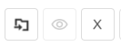

# ✏️ Borradores

En el menú Borradores se muestran todos los documentos que comenzaron a ser configurados para la recolección de firmas en la pantalla Nuevo Documento, pero que no tuvieron esta configuración concluida y no fueron enviados a los destinatarios.


<mark style="color:orange;">**Para guardar un documento como Borrador, el usuario debe hacer clic en “Concluir Más Tarde” en el momento de la creación del documento, en la pantalla**</mark>&#x20;

[<mark style="color:blue;">**Nuevo Documento > Agregar Documentos y Destinatarios.**</mark>](../menu-superior/novo-documento.md#a.-adicionar-documentos)


***

<figure><figcaption></figcaption></figure>

## Columnas de la pantalla principal - Borradores

<figure><figcaption></figcaption></figure>

**Columna Nombre del Documento:** En esta columna se exhiben el nombre del documento y el nombre del signatario. Si hay más de un signatario, se mostrará el nombre del primero y la cantidad de otras personas que deben firmar.

**Columna Responsable:** En esta columna se presentan el nombre y el correo electrónico de quien envió el documento (remitente). En la pantalla de Borradores, el único nombre y correo electrónico presentados serán los del propio usuario.

**Columna Estado:** En la pantalla de Borradores, el único estado posible para los documentos es "Creado", es decir, el documento ha sido registrado, pero aún no ha sido finalizado para su envío.

**Columna Tamaño:** En esta columna se muestra el tamaño del archivo del documento.

**Columna Carpeta:** En esta columna se muestra la carpeta del directorio donde el documento está almacenado.

**Columna Creado:** Información sobre la fecha y hora en que se creó el documento en la plataforma.

**Columna Acciones:** Esta columna muestra botones de acción sobre el documento. Estos botones se mostrarán de acuerdo con el perfil del usuario. Siempre se mostrará en este botón la acción prioritaria de ejecución, de acuerdo con el perfil del usuario y el estado del documento.

**Barra de filtro:** Es posible localizar uno o más documentos utilizando los filtros disponibles para la búsqueda. En la pantalla de Borradores, la búsqueda se puede realizar por el nombre del documento, por la carpeta donde el documento está alojado o por la fecha de creación del documento en la plataforma.

<figure><figcaption></figcaption></figure>

***

## Acciones individuales - Borradores

<figure><figcaption></figcaption></figure>

#### **Editar**

Al hacer clic en esta opción, el usuario es dirigido a la pantalla de registro del documento, donde deberá concluir la configuración del documento, incluir a los destinatarios y realizar las demás parametrizaciones necesarias para el envío del archivo y la recolección de las firmas.

<figure><figcaption></figcaption></figure>

#### **Alterar C**arpeta

Al hacer clic en esta opción, el usuario podrá cambiar la carpeta del directorio donde está almacenado el documento.

<figure><figcaption></figcaption></figure>

#### Descargar Archivo

Cuando el proceso tiene un documento o es un compartimiento de solo un documento del proceso, **el sistema descarga** el documento del **proceso y el registro de firmas** en una carpeta.zip.

La carpeta zip se nombra con el nombre del proceso y el archivo de registro de firma se nombra como **NombreDocumento\_Registro** de firma.

<figure><figcaption></figcaption></figure>

Cuando el proceso **tiene más de un documento**, el sistema muestra un modal con los documentos del proceso para que el usuario seleccione cuáles documentos desea descargar. Si es un compartimiento, solo se deben listar los documentos que han sido compartidos.

<figure><figcaption></figcaption></figure>

Al realizar la descarga a través del Menú > Borradores, por defecto de la plataforma, se genera el Registro de Firmas que muestra toda la información sobre las firmas electrónicas y digitales, como el nombre de los firmantes, la fecha y hora de la firma, la ubicación, la IP desde donde se realizó, los datos de los certificados digitales utilizados, etc. Sin embargo, aparece sin los datos de firma, ya que el envío del documento para firma no se ha efectivado.

<figure><figcaption></figcaption></figure>

#### **Eliminar**

Utilizado para eliminar el archivo, que irá a la [<mark style="color:blue;">carpeta de Eliminados</mark>](excluidos.md).&#x20;

<figure><figcaption></figcaption></figure>

#### **R**enombrar

Esta opción solo se mostrará si el usuario, además de ser firmante, también es el remitente del documento.

Cuando el proceso tiene solo un documento, el sistema permite cambiar el nombre del proceso:

<figure><figcaption></figcaption></figure>

Cuando el proceso tiene más de un documento, el sistema permite cambiar el nombre del proceso y el nombre de los documentos del proceso.

<figure><figcaption></figcaption></figure>

El campo "**Renombrar documentos del proceso**" se muestra solo si el usuario que ha iniciado sesión es el remitente del proceso y el proceso tiene más de un documento o archivo.

Por defecto, este campo aparece sin seleccionar y, al marcarlo, el sistema lista todos los documentos del proceso habilitados para edición.

El usuario tiene la posibilidad de mover los documentos, cambiando su orden. Al mover los documentos, el sistema actualiza la numeración frente a cada documento.

***

## Acciones en lote - Borradores

Es posible seleccionar más de un documento marcando las casillas de verificación junto al nombre del archivo y ejecutar acciones en lote.

<figure><figcaption>
Haga clic en la imagen para ampliarla.
</figcaption></figure>

#### **Mover Proceso (s)**

Al hacer clic en este ícono, será posible cambiar la carpeta donde se almacenan los documentos seleccionados. &#x20;

<figure><figcaption></figcaption></figure>

#### **Visualizar Proceso**

Después de seleccionar el documento y hacer clic en este ícono, el usuario tendrá acceso a la pantalla de registro del documento y podrá visualizar los datos del documento o proceso.

#### **E**liminar

Al hacer clic en este ícono, será posible eliminar los documentos seleccionados.&#x20;

<figure><figcaption></figcaption></figure>
