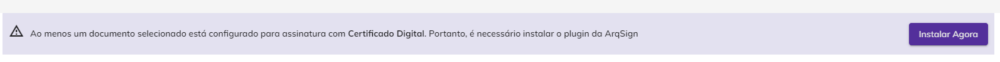

# ✍️ Firma de Documentos


<mark style="color:red;">Debido a un cambio de tecnología utilizado en la última actualización de la plataforma, todos los clientes deberán</mark> <mark style="color:red;"></mark><mark style="color:red;">**actualizar manualmente**</mark> <mark style="color:red;"></mark><mark style="color:red;">el instalador del</mark> <mark style="color:red;"></mark><mark style="color:red;">**AppNative**</mark> <mark style="color:red;"></mark><mark style="color:red;">(descargar e instalar), ya que no será posible realizar una actualización automática.</mark>

<mark style="color:red;">En el momento de la firma, si el proceso de actualización no ha sido realizado, la plataforma mostrará un mensaje para orientar al usuario sobre la actualización.</mark>


El proceso de firma electrónica de documentos puede realizarse de tres maneras:



Ocurre cuando el responsable recibe una notificación por correo electrónico, informando que el documento debe ser firmado y proporcionando el enlace para acceder al documento o a los documentos del proceso de firma.

El usuario responsable de la firma recibirá una notificación por correo electrónico con el enlace para acceder al(os) archivo(s). Este correo electrónico también mostrará el nombre del remitente y el plazo para la firma. Si el destinatario ha definido un mensaje personalizado, este también se mostrará en esta notificación.

<figure><figcaption></figcaption></figure>

Al hacer clic en el enlace o ingresar el código, el usuario será dirigido a la pantalla de firma.

<figure><figcaption></figcaption></figure>



Ocurre cuando el responsable recibe una notificación por WhatsApp, informando que el documento debe ser firmado y proporcionando el enlace para acceder al documento.

El usuario responsable de la firma recibirá un mensaje por WhatsApp con el enlace para acceder al archivo. Este mensaje también mostrará el nombre del remitente y el plazo para la firma. Si el destinatario ha definido un mensaje personalizado, este también se exhibirá en esta notificación.

<figure><figcaption></figcaption></figure>

Al hacer clic en el enlace o ingresar el código, el usuario será dirigido a la pantalla de firma.

<figure><figcaption></figcaption></figure>

Al finalizar el proceso, se mostrará un mensaje sugiriendo que cree una cuenta de prueba gratuita.


<mark style="color:orange;">**La creación de una cuenta de prueba gratuita no es obligatoria.**</mark>


<figure><figcaption></figcaption></figure>

El firmante también recibirá un mensaje por WhatsApp confirmando la finalización del proceso de firma.

<figure><figcaption></figcaption></figure>



Ocurre cuando la persona responsable de la firma accede directamente a la plataforma y verifica la lista de documentos pendientes de firma.

Después de iniciar sesión en su cuenta, el usuario debe hacer clic en el menú [<mark style="color:blue;">Caja Postal > Caja de Entrada</mark>](../caixa-postal/caixa-de-entrada.md). Para firmar un documento, es necesario hacer clic en el botón “Firmar” del archivo deseado.

<figure><figcaption></figcaption></figure>



***

## Firmando un documento

### Etapa 1 - Accediendo al documento&#x20;

Si el remitente ha definido un código de seguridad para abrir el documento, se solicitará que el firmante ingrese el código, que debe haber sido recibido anteriormente por correo electrónico, WhatsApp, SMS o por el propio remitente. Si no posee el código, el usuario debe hacer clic en “No Recibí el Código”.

<figure><figcaption></figcaption></figure>

<figure><figcaption></figcaption></figure>

El documento se presentará en la pantalla para la firma. En la parte superior de la pantalla se mostrarán los nombres del responsable por el envío, el nombre del documento, la navegación entre páginas y los botones de zoom y visualización del documento en pantalla completa.

<figure><figcaption></figcaption></figure>

Para el proceso que tiene **más de un documento no agrupado**, se presentará la pantalla con la lista de documentos del proceso.

La plataforma lista los documentos del proceso según el orden definido al enviar los documentos para la firma.

<figure><figcaption></figcaption></figure>

Al hacer clic en el enlace de un documento, el sistema muestra el documento seleccionado, presentando en el menú lateral los documentos del proceso y señalizando los documentos leídos y/o no leídos.

Para el proceso que tenga solo un documento, el sistema no mostrará una lista lateral de archivos y presentará únicamente el botón "Firmar" en el pie de página.

<figure><figcaption></figcaption></figure>


<mark style="color:blue;">Para procesos con un documento, el sistema muestra el botón "Firmar Documento" según el parámetro de obligatoriedad de lectura de los documentos.</mark>

<mark style="color:blue;">Si el proceso, con más de un documento, tiene la configuración de</mark> <mark style="color:blue;"></mark><mark style="color:blue;">**"Obligar Lectura de los Documentos"**</mark><mark style="color:blue;">, el sistema habilita el botón "Firmar Documento" solo después de la lectura de todos los documentos del proceso.</mark>




<figure><figcaption></figcaption></figure>

Cuando el proceso **tiene obligatoriedad de lectura** de los documentos, el botón de **"Firmar Documentos"** aparece deshabilitado para el usuario tan pronto como ingresa al proceso. En este caso, el ícono de visualización señala los documentos leídos y/o no leídos para que pueda revisar todos los archivos, habilitando al final de la lectura el botón de "Firmar Documentos".

<figure><figcaption></figcaption></figure>



<figure><figcaption></figcaption></figure>

Si el proceso no tiene obligatoriedad de lectura de los documentos, el botón de "**Firmar Documentos**" ya aparece habilitado para el usuario tan pronto como ingresa al proceso. En este caso, el ícono de visualización solo indica los documentos leídos y/o no leídos.



Al hacer clic en “Opciones”, el firmante podrá realizar las siguientes acciones:

<figure><figcaption></figcaption></figure>

#### Historial

Aquí es posible visualizar el historial del proceso de firma y sus documentos. Seleccione el botón de eventos para ver los datos en detalle.

Con el botón de eventos posicionado a la izquierda, observamos los datos del proceso en la pantalla.

<figure><figcaption></figcaption></figure>

Con el botón de eventos posicionado a la derecha, es posible visualizar los ID's y Hash's de los documentos, en el caso de un **proceso con más de un documento no agrupado**.

<figure><figcaption></figcaption></figure>

#### **R**echazar Firma

Utilizado cuando, por alguna razón, el firmante no desea firmar el documento. En este caso, debe ingresar una justificación para el rechazo y hacer clic en “Rechazar Firma”. Al rechazar la firma, el proceso de firma del documento será automáticamente cancelado para todos los involucrados y aparecerá con el estado “Cancelado” para el remitente responsable del documento.

<figure><figcaption></figcaption></figure>

#### **C**oncluir Más Tarde

Utilizado para regresar y concluir la firma en otro momento; siempre que se seleccione esta opción, la plataforma mostrará un mensaje de validación de la acción.

<figure><figcaption></figcaption></figure>

#### Descargar Archivo

La opción que permite descargar los documentos existentes en el proceso de firma. Seleccione el(los) archivo(s) que desea y haga clic en "Descargar".

<figure><figcaption></figcaption></figure>

En esta fase del proceso, los documentos aún no han sido firmados, por lo que solo es posible descargar los archivos, sin el registro de las firmas.

En el pie de página, también se encuentra el **"Término de firma electrónica"**, que puede ser visualizado por el usuario, así como la opción de cambiar el idioma de la plataforma, disponible actualmente en "Inglés - USA", "Español - España" o "Portugués - Brasil".

<figure><figcaption></figcaption></figure>

Al firmar el documento, el sistema registrará automáticamente la aceptación del “Término de Firma Electrónica” del firmante.

Para continuar con la firma, el firmante debe hacer clic en “Firmar”.&#x20;

<figure><figcaption></figcaption></figure>

### AppNative

Debido a un cambio en la tecnología utilizada en la última actualización de la plataforma, todos los clientes deberán **actualizar manualmente** el instalador de **AppNative** (descargar e instalar), ya que no será posible realizar la actualización de forma automática.

En el momento de la firma, si el proceso de actualización no se ha realizado, la plataforma deberá descargar el archivo de instalación y presentar un mensaje para orientar al usuario en el proceso de instalación.

<figure><figcaption></figcaption></figure>

### Etapa 2 - Datos del signatario y Anexos

En el siguiente paso, si hay una configuración previa que solicite al signatario proporcionar datos complementarios, deberá ingresarlos.

Si también se le ha solicitado al signatario adjuntar archivos, en el campo "Anexos" deberá cargar los documentos solicitados. Después de completar esta etapa, el usuario debe hacer clic en "Avanzar".

<figure><figcaption></figcaption></figure>

***

### Etapa 3 - Estilo de Firma

El Estilo de Firma es la representación visual de la firma del usuario. Para completar la firma de un documento, el usuario deberá elegir cómo firmará, considerando las configuraciones realizadas por el destinatario en [<mark style="color:blue;">Nuevo Documento</mark>](novo-documento.md#b.-destinatarios). En este momento, el destinatario deberá informar qué representación visual debe ser utilizada por el firmante: "Estándar, Dibujo o Imagen", o solo "Estándar (Texto)", o solo "Dibujo", o solo "Imagen".

<figure><figcaption></figcaption></figure>

* **Estándar:** En este estilo, el usuario debe proporcionar su nombre completo y definir el estilo (fuente) en el que se presentará el texto. Para esto, debe hacer clic en "Estilo" y realizar la configuración.

<figure><figcaption></figcaption></figure>

*   &#x20;**Diseño:** Para firmar con un diseño, el usuario deberá, en el campo "Área de Diseño de la Firma", firmar o rubricar utilizando el mouse. Para corregir, debe hacer clic en el ícono "Borrar".&#x20;

    <figure><figcaption></figcaption></figure>
*   **Imagen:** Si lo desea, el usuario puede subir una imagen que represente su firma.

    <figure><figcaption></figcaption></figure>

Para finalizar, el firmante debe hacer clic en "Concluir". Si se le ha solicitado que firme como Persona Física y Jurídica en el documento, se utilizará la misma firma para ambas situaciones.

<figure><figcaption></figcaption></figure>

***

### Etapa 4 - Firmando electrónicamente o con certificado digital


<mark style="color:blue;">**FIRMA ELECTRÓNICA X FIRMA DIGITAL (ICP Brasil e ICP Otros)**</mark>

<mark style="color:blue;">**La firma electrónica**</mark> <mark style="color:blue;"></mark><mark style="color:blue;">es aquella que no necesita un certificado digital. Se utiliza más para firmar contratos y documentos entre entidades privadas (B2B, B2C).</mark>

<mark style="color:blue;">**La firma digital**</mark> <mark style="color:blue;"></mark><mark style="color:blue;">es aquella que necesita un certificado digital. Se utiliza más para la emisión de facturas y para transacciones con el gobierno.</mark>

<mark style="color:blue;">En la Plataforma Arqsign, al configurar un flujo de firmas, puedes determinar qué tipo de firma debe ser ejecutada por el destinatario eligiendo entre:</mark>

<mark style="color:blue;">**a) Firma electrónica**</mark> <mark style="color:blue;"></mark><mark style="color:blue;">(ArqSign produce firmas electrónicas avanzadas con validez jurídica de acuerdo con MP 2.200-2 de 24/08/2001 y Ley 14.063 de 23/11/2020). Siempre que un firmante firma un documento de forma electrónica, Arqsign aplica un certificado digital propio de la plataforma, capturando el Hash (identificación única) del archivo, verificando la integridad del archivo y anexando al certificado la identificación del firmante.</mark>

<mark style="color:blue;">**b) Firma digital – ICP-Brasil o ICP Otros**</mark> <mark style="color:blue;"></mark><mark style="color:blue;">(ArqSign produce firmas digitales calificadas de acuerdo con MP 2.200-2 de 24/08/2001 y Ley 14.063 de 23/11/2020). Cuando el usuario ya posee un certificado digital y desea utilizarlo para realizar la firma a través de ArqSign, este certificado se utiliza para verificar la integridad de la firma e identificar al usuario como firmante en el documento.</mark>


Después de definir el Estilo de Firma, se solicitará la firma del usuario, que puede ser:

#### A. Firma Electrónica

En la firma electrónica, el usuario informa sus datos de persona física o jurídica y la propia Arqivar certifica la autenticidad y veracidad de la información presentada.

Si el usuario está utilizando una firma electrónica, será necesario que complete los campos obligatorios solicitados. Los campos obligatorios varían según el documento. El símbolo \* indica que la información es de llenado obligatorio.

<figure><figcaption></figcaption></figure>

#### B. Firma Digital – ICP Brasil y Otros

Si se ha definido que el usuario debe firmar utilizando un certificado digital (ICP Brasil y otros), se mostrará una lista con todos los certificados instalados en la máquina del usuario y en la cuenta de la plataforma ArqSign.

<figure><figcaption></figcaption></figure>

Deberá seleccionar el método con el cual realizará la firma y, si es necesario, ingresar el código PIN del certificado digital (si se solicita). En caso de que deba firmar también como Persona Jurídica, se utilizará la misma firma para ambas situaciones.

<figure><figcaption></figcaption></figure>


<mark style="color:orange;">**Los certificados alojados en la cuenta de la plataforma ArqSign del usuario que se presenten aquí deben haber sido previamente importados en la pantalla**</mark> [<mark style="color:blue;">**Mi Perfil > Pestaña**</mark>](meu-perfil.md) <mark style="color:orange;">**Certificado Digital. Si el usuario tiene el certificado digital alojado en ArqSign, se le ofrecerá la opción de autenticarse en la plataforma para utilizar el certificado que posee.**</mark>


Instalación de los complementos necesarios para la utilización de los certificados digitales.

Si aún no lo ha hecho, al firmar un documento por primera vez utilizando un certificado digital, se le solicitará al usuario que instale los complementos "ArqSign Certificado Digital" (disponible haciendo[ <mark style="color:blue;">clic aquí</mark>](https://chromewebstore.google.com/detail/arqsign-certificado-digit/fjdnpmenmpfadeojgkhgiogiclmcjgbp?hl=pt-br)) y AppNative - Módulo Desktop (disponible durante el proceso).

1\. Al hacer clic en "Instalar Ahora", se abrirá una ventana con el enlace para descargar el complemento "ArqSign Certificado Digital".

.png>)

2\. Realiza la instalación de la extensión de acuerdo con el navegador que estés utilizando.&#x20;

.png>).png>)

3\. Después de completar la primera instalación, regrese a la plataforma ArqSign y continúe con la instalación de la aplicación AppNative haciendo clic en "Haga clic aquí para descargar...".&#x20;

.png>)

4\.  Después de completar la segunda instalación, regrese a la plataforma ArqSign. Se mostrará un mensaje confirmando la finalización de las instalaciones.

.png>)

Para finalizar el proceso de firma, el firmante debe hacer clic en "Concluir". Será dirigido a la pantalla de inicio de sesión. Si ya tiene una cuenta activa en la plataforma de firma, puede ingresar sus credenciales para acceder. Si no tiene una cuenta registrada en la plataforma, se mostrará un mensaje sugiriendo que se cree una cuenta de prueba gratuita.

<figure><figcaption></figcaption></figure>


<mark style="color:orange;">**La creación de la cuenta de prueba gratuita no es obligatoria.**</mark>


***

## Concluyendo la firma

Una vez finalizado el proceso de firma, el destinatario recibe la notificación de conclusión de las firmas, por correo electrónico o WhatsApp, donde la plataforma envía la(s) copia(s) del(os) Documento(s) firmado(s) y el respectivo Registro de Firmas a los destinatarios, considerando las configuraciones de la cuenta (enlace o archivo). Cuando haya más de un archivo en el proceso, la plataforma envía un archivo zip con todos los documentos y su respectivo registro de firma.

<figure><figcaption></figcaption></figure>

<figure><figcaption></figcaption></figure>

Si el remitente ha definido que se debe generar un Código QR en el Registro de Firmas en la pantalla [<mark style="color:blue;">Configuraciones Avanzadas del registro del documento</mark>](novo-documento.md#configuracoes-avancadas), este Código QR se mostrará en la hoja de registro de las firmas.

<figure><figcaption></figcaption></figure>

***
