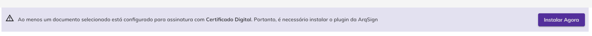

# ✍️ Firma de Documentos

El proceso de firma electrónica de documentos puede realizarse de tres maneras:



Ocurre cuando el responsable recibe una notificación por correo electrónico, informando que el documento debe ser firmado y proporcionando el enlace para acceder al documento o a los documentos del proceso de firma.

El usuario responsable de la firma recibirá una notificación por correo electrónico con el enlace para acceder al(os) archivo(s). Este correo electrónico también mostrará el nombre del remitente y el plazo para la firma. Si el destinatario ha definido un mensaje personalizado, este también se mostrará en esta notificación.

<figure><figcaption></figcaption></figure>

Al hacer clic en el enlace o ingresar el código, el usuario será dirigido a la pantalla de firma.

<figure><figcaption></figcaption></figure>



Ocurre cuando el responsable recibe una notificación por WhatsApp, informando que el documento debe ser firmado y proporcionando el enlace para acceder al documento.

El usuario responsable de la firma recibirá un mensaje por WhatsApp con el enlace para acceder al archivo. Este mensaje también mostrará el nombre del remitente y el plazo para la firma. Si el destinatario ha definido un mensaje personalizado, este también se exhibirá en esta notificación.

<figure><figcaption></figcaption></figure>

Al hacer clic en el enlace o ingresar el código, el usuario será dirigido a la pantalla de firma.

<figure><figcaption></figcaption></figure>

Al finalizar el proceso, se mostrará un mensaje sugiriendo que cree una cuenta de prueba gratuita.


<mark style="color:orange;">**La creación de una cuenta de prueba gratuita no es obligatoria.**</mark>


<figure><figcaption></figcaption></figure>

El firmante también recibirá un mensaje por WhatsApp confirmando la finalización del proceso de firma.

<figure><figcaption></figcaption></figure>



Ocurre cuando la persona responsable de la firma accede directamente a la plataforma y verifica la lista de documentos pendientes de firma.

Después de iniciar sesión en su cuenta, el usuario debe hacer clic en el menú [<mark style="color:blue;">Caja Postal > Caja de Entrada</mark>](../caixa-postal/caixa-de-entrada.md). Para firmar un documento, es necesario hacer clic en el botón “Firmar” del archivo deseado.

<figure><figcaption></figcaption></figure>



***

## Firmando un documento



## Etapa 1 - Accediendo al documento&#x20;

Si el remitente ha definido un código de seguridad para abrir el documento, se solicitará que el firmante ingrese el código, que debe haber sido recibido anteriormente por correo electrónico, WhatsApp, SMS o por el propio remitente. Si no posee el código, el usuario debe hacer clic en “No Recibí el Código”.

<figure><figcaption></figcaption></figure>

<figure><figcaption></figcaption></figure>

El documento se presentará en la pantalla para la firma. En la parte superior de la pantalla se mostrarán los nombres del responsable por el envío, el nombre del documento, la navegación entre páginas y los botones de zoom y visualización del documento en pantalla completa.

<figure><figcaption></figcaption></figure>

Para el proceso que tiene **más de un documento no agrupado**, se presentará la pantalla con la lista de documentos del proceso.

La plataforma lista los documentos del proceso según el orden definido al enviar los documentos para la firma.

<figure><figcaption></figcaption></figure>

Al hacer clic en el enlace de un documento, el sistema muestra el documento seleccionado, presentando en el menú lateral los documentos del proceso y señalizando los documentos leídos y/o no leídos.

Para el proceso que tenga solo un documento, el sistema no mostrará una lista lateral de archivos y presentará únicamente el botón "Firmar" en el pie de página.

<figure><figcaption></figcaption></figure>


<mark style="color:blue;">Para procesos con un documento, el sistema muestra el botón "Firmar Documento" según el parámetro de obligatoriedad de lectura de los documentos.</mark>

<mark style="color:blue;">Si el proceso, con más de un documento, tiene la configuración de</mark> <mark style="color:blue;"></mark><mark style="color:blue;">**"Obligar Lectura de los Documentos"**</mark><mark style="color:blue;">, el sistema habilita el botón "Firmar Documento" solo después de la lectura de todos los documentos del proceso.</mark>




<figure><figcaption></figcaption></figure>

Cuando el proceso **tiene obligatoriedad de lectura** de los documentos, el botón de **"Firmar Documentos"** aparece deshabilitado para el usuario tan pronto como ingresa al proceso. En este caso, el ícono de visualización señala los documentos leídos y/o no leídos para que pueda revisar todos los archivos, habilitando al final de la lectura el botón de "Firmar Documentos".

<figure><figcaption></figcaption></figure>



<figure><figcaption></figcaption></figure>

Si el proceso no tiene obligatoriedad de lectura de los documentos, el botón de "**Firmar Documentos**" ya aparece habilitado para el usuario tan pronto como ingresa al proceso. En este caso, el ícono de visualización solo indica los documentos leídos y/o no leídos.



Al hacer clic en “Opciones”, el firmante podrá realizar las siguientes acciones:

<figure><figcaption></figcaption></figure>

#### Historial

Aquí es posible visualizar el historial del proceso de firma y sus documentos. Seleccione el botón de eventos para ver los datos en detalle.

Con el botón de eventos posicionado a la izquierda, observamos los datos del proceso en la pantalla.

<figure><figcaption></figcaption></figure>

Con el botón de eventos posicionado a la derecha, es posible visualizar los ID's y Hash's de los documentos, en el caso de un **proceso con más de un documento no agrupado**.

<figure><figcaption></figcaption></figure>

#### **R**echazar Firma

Utilizado cuando, por alguna razón, el firmante no desea firmar el documento. En este caso, debe ingresar una justificación para el rechazo y hacer clic en “Rechazar Firma”. Al rechazar la firma, el proceso de firma del documento será automáticamente cancelado para todos los involucrados y aparecerá con el estado “Cancelado” para el remitente responsable del documento.

<figure><figcaption></figcaption></figure>

#### **C**oncluir Más Tarde

Utilizado para regresar y concluir la firma en otro momento; siempre que se seleccione esta opción, la plataforma mostrará un mensaje de validación de la acción.

<figure><figcaption></figcaption></figure>

#### Descargar Archivo

La opción que permite descargar los documentos existentes en el proceso de firma. Seleccione el(los) archivo(s) que desea y haga clic en "Descargar".

<figure><figcaption></figcaption></figure>

En esta fase del proceso, los documentos aún no han sido firmados, por lo que solo es posible descargar los archivos, sin el registro de las firmas.

En el pie de página, también se encuentra el **"Término de firma electrónica"**, que puede ser visualizado por el usuario, así como la opción de cambiar el idioma de la plataforma, disponible actualmente en "Inglés - USA", "Español - España" o "Portugués - Brasil".

<figure><figcaption></figcaption></figure>

Al firmar el documento, el sistema registrará automáticamente la aceptación del “Término de Firma Electrónica” del firmante.

Para continuar con la firma, el firmante debe hacer clic en “Firmar”.&#x20;

<figure><figcaption></figcaption></figure>

## Etapa 2 - Datos del signatario y Anexos

En el siguiente paso, si hay una configuración previa que solicite al signatario proporcionar datos complementarios, deberá ingresarlos.

Si también se le ha solicitado al signatario adjuntar archivos, en el campo "Anexos" deberá cargar los documentos solicitados. Después de completar esta etapa, el usuario debe hacer clic en "Avanzar".

<figure><figcaption></figcaption></figure>

***

## Etapa 3 - Estilo de Firma

El Estilo de Firma es la representación visual de la firma del usuario. Para completar la firma de un documento, el usuario deberá elegir cómo firmará, considerando las configuraciones realizadas por el destinatario en [<mark style="color:blue;">Nuevo Documento</mark>](novo-documento.md#b.-destinatarios). En este momento, el destinatario deberá informar qué representación visual debe ser utilizada por el firmante: "Estándar, Dibujo o Imagen", o solo "Estándar (Texto)", o solo "Dibujo", o solo "Imagen".

<figure><figcaption></figcaption></figure>

* **Estándar:** En este estilo, el usuario debe proporcionar su nombre completo y definir el estilo (fuente) en el que se presentará el texto. Para esto, debe hacer clic en "Estilo" y realizar la configuración.

<figure><figcaption></figcaption></figure>

*   &#x20;**Diseño:** Para firmar con un diseño, el usuario deberá, en el campo "Área de Diseño de la Firma", firmar o rubricar utilizando el mouse. Para corregir, debe hacer clic en el ícono "Borrar".&#x20;

    <figure><figcaption></figcaption></figure>
*   **Imagen:** Si lo desea, el usuario puede subir una imagen que represente su firma.

    <figure><figcaption></figcaption></figure>

Para finalizar, el firmante debe hacer clic en "Concluir". Si se le ha solicitado que firme como Persona Física y Jurídica en el documento, se utilizará la misma firma para ambas situaciones.

<figure><figcaption></figcaption></figure>

***

## Etapa 4 - Firmando electrónicamente o con certificado digital


<mark style="color:blue;">**FIRMA ELECTRÓNICA X FIRMA DIGITAL (ICP Brasil e ICP Otros)**</mark>

<mark style="color:blue;">**La firma electrónica**</mark> <mark style="color:blue;"></mark><mark style="color:blue;">es aquella que no necesita un certificado digital. Se utiliza más para firmar contratos y documentos entre entidades privadas (B2B, B2C).</mark>

<mark style="color:blue;">**La firma digital**</mark> <mark style="color:blue;"></mark><mark style="color:blue;">es aquella que necesita un certificado digital. Se utiliza más para la emisión de facturas y para transacciones con el gobierno.</mark>

<mark style="color:blue;">En la Plataforma Arqsign, al configurar un flujo de firmas, puedes determinar qué tipo de firma debe ser ejecutada por el destinatario eligiendo entre:</mark>

<mark style="color:blue;">**a) Firma electrónica**</mark> <mark style="color:blue;"></mark><mark style="color:blue;">(ArqSign produce firmas electrónicas avanzadas con validez jurídica de acuerdo con MP 2.200-2 de 24/08/2001 y Ley 14.063 de 23/11/2020). Siempre que un firmante firma un documento de forma electrónica, Arqsign aplica un certificado digital propio de la plataforma, capturando el Hash (identificación única) del archivo, verificando la integridad del archivo y anexando al certificado la identificación del firmante.</mark>

<mark style="color:blue;">**b) Firma digital – ICP-Brasil o ICP Otros**</mark> <mark style="color:blue;"></mark><mark style="color:blue;">(ArqSign produce firmas digitales calificadas de acuerdo con MP 2.200-2 de 24/08/2001 y Ley 14.063 de 23/11/2020). Cuando el usuario ya posee un certificado digital y desea utilizarlo para realizar la firma a través de ArqSign, este certificado se utiliza para verificar la integridad de la firma e identificar al usuario como firmante en el documento.</mark>


Después de definir el Estilo de Firma, se solicitará la firma del usuario, que puede ser:

### A. Firma Electrónica

En la firma electrónica, el usuario informa sus datos de persona física o jurídica y la propia Arqivar certifica la autenticidad y veracidad de la información presentada.

Si el usuario está utilizando una firma electrónica, será necesario que complete los campos obligatorios solicitados. Los campos obligatorios varían según el documento. El símbolo \* indica que la información es de llenado obligatorio.

<figure><figcaption></figcaption></figure>

### B. Firma Digital – ICP Brasil y Otros

### Instalación de los plugins necesarios para el uso de los certificados digitales

Para el uso de la firma digital será necesario, antes del primer uso, la instalación de la extensión “ArqSign Certificado Digital” (disponible en las tiendas de extensiones de los navegadores) y del Módulo Nativo de Arquivar (disponibilizado durante el proceso).

1. Al hacer clic en “Instalar Ahora”, se abrirá la ventana con el enlace para descargar la extensión “ArqSign Certificado Digital”.

.png>)

2. Instale la extensión de acuerdo con el navegador que esté utilizando.

.png>) (1) (1).png>)

3. Después de concluir la primera instalación, regrese a la plataforma ArqSign y continúe con la instalación del plugin Módulo Nativo de Arquivar haciendo clic en “Haga clic aquí para descargar...”.

.png>) (1) (1) (1) (1) (1) (1).png>)

4. Después de concluir la segunda instalación, regrese a la plataforma ArqSign. Se mostrará un mensaje de finalización de las instalaciones.

<figure><figcaption></figcaption></figure>

***


<mark style="color:orange;">**AppNative**</mark>

### <mark style="color:orange;">Debido a un cambio de tecnología utilizado en la última actualización de la plataforma, todos los clientes deberán actualizar manualmente el instalador de AppNative (descargar e instalar), ya que no será posible realizar la actualización de forma automática.</mark>

<mark style="color:orange;">En el momento de la firma, si el proceso de actualización no ha sido realizado, la plataforma deberá descargar el archivo de instalación y presentar un mensaje para orientar al usuario en el proceso de instalación.</mark>



### Instalación de la Extensión en diferentes navegadores de internet



1. Para instalar la extensión "ArqSign Certificado Digital" en Google Chrome debe hacer clic en los tres puntos en la esquina superior izquierda de la pantalla.

<figure><figcaption></figcaption></figure>

2. A continuación, haga clic en "Extensiones" y luego en "Acceder a Chrome Web Store".

<figure><figcaption></figcaption></figure>

3. Busque "ArqSign Certificado Digital".

<figure><figcaption></figcaption></figure>

4.  Haga clic en el resultado de la búsqueda.

    <figure><figcaption></figcaption></figure>
5. Haga clic en "Usar en Chrome".

<figure><figcaption></figcaption></figure>

6. Haga clic en "Agregar extensión".

<figure><figcaption></figcaption></figure>

7. Listo! Extensión agregada con éxito, solo necesitará hacer esto la primera vez que firme con certificado digital; en las próximas ocasiones, la extensión ya permanecerá instalada en su navegador.



1. Para instalar la extensión "ArqSign Certificado Digital" en Mozilla Firefox, debe hacer clic en el ícono de pieza de rompecabezas en la esquina superior izquierda de la pantalla.

<figure><figcaption></figcaption></figure>

2. Buscar "ArqSign Certificado Digital".

<figure><figcaption></figcaption></figure>

3. Hacer clic en el resultado de la búsqueda.

<figure><figcaption></figcaption></figure>

4. Hacer clic en "Agregar a Firefox".

<figure><figcaption></figcaption></figure>

5. Hacer clic en "Agregar".

<figure><figcaption></figcaption></figure>

6. ¡Listo! Extensión añadida con éxito. Solo necesitará hacer esto la primera vez que firme con certificado digital; en las próximas ocasiones, la extensión ya permanecerá instalada en su navegador.



1. Para instalar la extensión "ArqSign Certificado Digital" en Microsoft Edge, debe hacer clic en los tres puntitos en la esquina superior izquierda de la pantalla.

<figure><figcaption></figcaption></figure>

2. Luego, haga clic en "Extensiones".

<figure><figcaption></figcaption></figure>

3. Haga clic en "Obtener extensiones de Microsoft Edge".

<figure><figcaption></figcaption></figure>

4. Busque "ArqSign Certificado Digital".

<figure><figcaption></figcaption></figure>

5. Haga clic en "Obtener".

<figure><figcaption></figcaption></figure>

6. Haga clic en "Agregar extensión".

<figure><figcaption></figcaption></figure>

7. ¡Listo! Extensión añadida con éxito. Solo necesitará hacer esto la primera vez que firme con certificado digital; en las próximas ocasiones, la extensión ya permanecerá instalada en su navegador.



***

<mark style="color:blue;">**Habiendo instalado la extensión y el módulo del certificado, el usuario podrá continuar con el proceso de firma.**</mark>

### Firmando con Certificado Digital

Si se ha definido que el usuario debe firmar utilizando un certificado digital (ICP Brasil y otros), se mostrará una lista con todos los certificados instalados en la máquina del usuario y en la cuenta de la plataforma ArqSign.

<figure><figcaption></figcaption></figure>

Deberá seleccionar el método con el cual realizará la firma y, si es necesario, ingresar el código PIN del certificado digital (si se solicita). En caso de que deba firmar también como Persona Jurídica, se utilizará la misma firma para ambas situaciones.

<figure><figcaption></figcaption></figure>


<mark style="color:orange;">**Los certificados alojados en la cuenta de la plataforma ArqSign del usuario que se presenten aquí deben haber sido previamente importados en la pantalla**</mark> [<mark style="color:blue;">**Mi Perfil > Pestaña**</mark>](meu-perfil.md) <mark style="color:orange;">**Certificado Digital. Si el usuario tiene el certificado digital alojado en ArqSign, se le ofrecerá la opción de autenticarse en la plataforma para utilizar el certificado que posee.**</mark>


Para finalizar el proceso de firma, el firmante debe hacer clic en "Concluir". Será dirigido a la pantalla de inicio de sesión.&#x20;

Si ya tiene una cuenta activa en la plataforma de firma, puede ingresar sus credenciales para acceder. Si no tiene una cuenta registrada en la plataforma, se mostrará un mensaje sugiriendo que se cree una cuenta de prueba gratuita.

<figure><figcaption></figcaption></figure>

Si ya tiene una cuenta activa en la plataforma de firma, pero no **ha iniciado sesión**, podrá hacer clic en la opción "acceder a mi cuenta" y podrá ingresar sus credenciales para acceder. 

<figure><figcaption></figcaption></figure>

Si el signatario **no tiene una cuenta registrada** en la plataforma, se mostrará un mensaje sugiriendo que cree una [cuenta de prueba gratuita](https://manual.arquivar.com/manual-arqsign-or-espanhol/#sitio-web-de-la-plataforma-arqsign), o que obtenga más información, donde el usuario será dirigido a la página de más información en el sitio de ArqSign.

<figure><figcaption></figcaption></figure>


<mark style="color:orange;">**La creación de la cuenta de prueba gratuita no es obligatoria.**</mark>


***

## Concluyendo la firma

Una vez finalizado el proceso de firma, el destinatario recibe la notificación de conclusión de las firmas, por correo electrónico o WhatsApp, donde la plataforma envía la(s) copia(s) del(os) Documento(s) firmado(s) y el respectivo Registro de Firmas a los destinatarios, considerando las configuraciones de la cuenta (enlace o archivo). Cuando haya más de un archivo en el proceso, la plataforma envía un archivo zip con todos los documentos y su respectivo registro de firma.

<figure><figcaption></figcaption></figure>

<figure><figcaption></figcaption></figure>

Si el remitente ha definido que se debe generar un Código QR en el Registro de Firmas en la pantalla [<mark style="color:blue;">Configuraciones Avanzadas del registro del documento</mark>](novo-documento.md#configuracoes-avancadas), este Código QR se mostrará en la hoja de registro de las firmas.

<figure><figcaption></figcaption></figure>

***

## 🗪 Preguntas y Respuestas Frecuentes

¿Firmando electrónicamente, no necesito firmar físicamente?

Al firmar electrónicamente con ArqSign, no es necesario imprimir el documento para recolectar firmas físicas. La firma digital garantiza validez jurídica al archivo digital, dispensando copias en papel.

¿Es seguro firmar un documento electrónicamente?

Todo dependerá de la plataforma elegida para realizar la firma. Con ArqSign, herramienta de firma electrónica desarrollada por Arquivar, la conformidad con la legislación está garantizada mediante la seguridad en los procesos, la tecnología empleada y las mejores prácticas de seguridad presentes en el mercado nacional e internacional. Conozca más sobre la seguridad del proceso y la tecnología de la Plataforma ArqSign accediendo a:\
[https://arquivar.com.br/arqsign-validade-juridica/](https://arquivar.com.br/arqsign-validade-juridica/)

¿Cuáles son los beneficios y ventajas de la firma electrónica?

Los beneficios son diversos, desde firmar un documento en minutos, menor costo en impresiones, mensajería, correos, almacenamiento, hasta menos riesgos jurídicos, ya que evita la falsificación y alteración. También hay ganancia en productividad, pues automatiza el proceso, reduce la burocracia y ahorra tiempo a los firmantes. Sin mencionar la innovación y la sostenibilidad.

¿Cómo se clasifican las Firmas Electrónicas?

De acuerdo con la ley nº 14.063, del 23 de septiembre de 2020, art. 4º, las firmas electrónicas se clasifican en:

**I -** Firma electrónica simple:

a) la que permite identificar a su firmante;

b) la que adjunta o asocia datos a otros datos en formato electrónico del firmante;

**II-** Firma electrónica avanzada: la que utiliza certificados no emitidos por la ICP-Brasil u otro medio de comprobación de la autoría, integridad de documentos y aceptación entre las partes.

**III -** Firma electrónica calificada: la que utiliza certificado digital ICP-Brasil.\
Los 3 (tres) tipos de firma referidos en la legislación caracterizan el nivel de confianza de la firma, siendo que la firma electrónica calificada es la que posee el nivel más elevado.

La Plataforma ArqSign está capacitada para generar Firmas Avanzadas y Calificadas, cumpliendo rigurosamente con todos los requisitos legales.

¿Cuál es la diferencia entre firma digital y firma electrónica?

De forma sencilla, toda firma realizada a través de un mecanismo electrónico que identifica quién la ejecutó es una firma electrónica.

En Bolivia (y culturalmente similar a Brasil), se define que una firma realizada electrónicamente con certificado digital propio se llama firma digital, y cuando se realiza electrónicamente sin certificado digital propio se llama firma electrónica.

La firma electrónica se utiliza más para firmas entre empresas y clientes, profesionales y clientes o pacientes, etc.

La firma digital se utiliza más para firmas y transacciones que involucran organismos gubernamentales.

¿Qué es la firma digital?

En Bolivia (similar a Brasil), decimos que la Firma Digital es un tipo de firma electrónica realizada utilizando un certificado digital ICP-Brasil propio, que es como una identidad en el mundo virtual.

Se diferencia de las demás firmas electrónicas por usar criptografía y vincular el certificado digital al documento electrónico que está siendo firmado.

La tecnología del certificado digital da garantías de integridad del documento y autoría incontestable del firmante, siendo la forma de firma electrónica más confiable.

Para realizar una firma digital, se necesita adquirir un Certificado Digital ICP-Brasil y una plataforma de firma electrónica confiable.

¿Qué documentos puedo firmar electrónicamente (sin certificado digital)?

Legalmente, entre entidades privadas, cualquier documento puede ser firmado electrónicamente siempre que las partes estén de acuerdo. A continuación, listamos algunos ejemplos de documentos:

* Propuestas,
* Presupuestos,
* Contratos,
* Adendas,
* Rescisiones,
* Informes,
* Transacciones inmobiliarias,
* Acuerdos de servicios,
* Actas,
* Términos de adhesión,
* Proyectos,
* Peticiones,
* Y muchos otros.

¿Qué es la firma electrónica?

Se puede definir la firma electrónica como un mecanismo electrónico que identifica al firmante (persona que está firmando) de un documento, ya sea persona natural o jurídica.

En Bolivia (similar a Brasil), la firma electrónica está respaldada por normativas y leyes equivalentes a la Medida Provisoria 2.200-2 de 2001, el Código Civil y las Instrucciones Normativas del Instituto Nacional de Tecnología de la Información (ITI) de Brasil.

Es importante señalar que culturalmente en Brasil se define que una firma realizada electrónicamente con certificado digital se llama firma digital, y cuando se realiza electrónicamente sin certificado digital se llama firma electrónica.

¿Cómo configurar un documento para ser firmado con Certificado Digital (firma digital) o sin certificado digital (firma electrónica)?

En la Plataforma ArqSign, al configurar un proceso de firmas, puede determinar qué tipo de firma debe ejecutar cada destinatario eligiendo entre:

**a) Firma electrónica** (ArqSign produce firmas electrónicas avanzadas con validez jurídica según la MP 2.200-2 del 24/08/2001 y la Ley 14.063 del 23/11/2020);\
**b) Firma con Certificado** **Digital Personal tipo ICP-Brasil** (ArqSign produce firmas digitales calificadas según la MP 2.200-2 del 24/08/2001 y la Ley 14.063 del 23/11/2020);\
**c) Firma con Certificado Digital Personal de todos los tipos** (ArqSign produce firmas electrónicas y digitales mediante otros certificados).

Para determinar el tipo de firma siga los siguientes pasos:

1. Después de subir el documento y hacer las configuraciones necesarias, continúe con la configuración de los destinatarios;
2. Al configurar un destinatario, en el campo "Tipo de firma" elija una de las opciones según la descripción anterior;
3. ¡Listo! Ahora solo configure los demás destinatarios y la posición de las firmas en el documento y envíe.

Para saber cómo firmar un documento con Certificado Digital - ICP-Brasil [haga clic aquí](https://manual.arquivar.com/manual-arqsign-or-espanhol/preguntas-frecuentes/certificado-digital).

¿Cómo firmar un documento con Certificado Digital - ICP-Brasil?

En la Plataforma ArqSign, el remitente de documentos puede determinar el tipo de firma que el destinatario debe ejecutar eligiendo entre una de las siguientes opciones:

**a) Firma electrónica** (ArqSign produce firmas electrónicas avanzadas con validez jurídica según la MP 2.200-2 del 24/08/2001 y la Ley 14.063 del 23/11/2020);

**b) Firma con Certificado Digital Personal tipo ICP-Brasil** (ArqSign produce firmas digitales calificadas según la MP 2.200-2 del 24/08/2001 y la Ley 14.063 del 23/11/2020);

**c) Firma con Certificado Digital Personal de todos los tipos** (ArqSign produce firmas electrónicas y digitales mediante otros certificados).

Si recibió un documento para firmar vía Plataforma ArqSign y necesita firmar con Certificado Digital por primera vez, siga los siguientes pasos:

* Abra el documento, léalo y si está de acuerdo, haga clic en Firmar;
* Ejecute la firma en el formato de su preferencia y haga clic en Avanzar;
* Al hacer clic en "Avanzar", se le informará que la firma solicitada debe ejecutarse con certificado digital;

Seleccione cuál certificado se utilizará para firmar el documento entre las opciones:

1. Certificados que fueron ingresados en ArqSign y están guardados en la plataforma; y
2. Certificados guardados en la computadora de quien está firmando el documento.

<figure><figcaption></figcaption></figure>

Para firma con Certificado ingresado en la Plataforma, haga clic en la opción indicada;\
Para firma con Certificado digital instalado en su computadora deberá seguir los pasos indicados para:

1. Agregar la extensión ArqSign a su navegador;
2. Instalar el módulo de escritorio;

* Ingrese la contraseña del Certificado Digital y haga clic en Avanzar.

El paso a paso para agregar la extensión a su navegador y el módulo de escritorio puede ser accedido a continuación:

* [Cómo agregar la extensión ArqSign en el navegador Chrome.](https://arquivar.com.br/faq-assuntos/como-adicionar-extensao-arqsign-certificado-digital-no-navegador-chrome/)
* [Cómo agregar la extensión ArqSign en el navegador Edge.](https://arquivar.com.br/faq-assuntos/como-adicionar-extensao-arqsign-certificado-digital-no-navegador-edge/)
* [Cómo agregar la extensión ArqSign en el navegador FireFox.](https://arquivar.com.br/faq-assuntos/como-adicionar-extensao-arqsign-no-navegador-firefox/)
* [Cómo instalar el módulo de escritorio.](https://arquivar.com.br/faq-assuntos/como-instalar-modulo-desktop/)

¿Cómo agregar la extensión ArqSign Certificado Digital en el navegador Edge?

1. Cuando un firmante de un documento que requiere un certificado digital, ya sea ICP-Brasil u otro, aplica su representación visual y hace clic en el botón Avanzar, se mostrará un mensaje informando que para firmar el documento con el Certificado Digital instalado en la computadora es necesario agregar la extensión en su navegador y luego instalar el módulo de escritorio. El proceso es simple. Solo debe hacer clic en el enlace mostrado y seguir los pasos:
2. En Microsoft Edge, al hacer clic en el enlace disponible, puede ocurrir el bloqueo de ventanas emergentes.
3. En caso de que esto ocurra, debe hacer clic en el ícono de bloqueo de pop-ups, al lado del URL de la página.
4. Al hacer clic en el ícono, debe permitir pop-ups para la página de ArqSign.
5. Después de desbloquear los pop-ups, debe hacer clic nuevamente en el enlace disponible. Al hacer clic en el enlace, se ejecutarán dos acciones al mismo tiempo: la primera es la descarga del instalador del Módulo de Escritorio. Debe esperar a que se complete la descarga y seguir los pasos del Tutorial de Instalación del Módulo de Escritorio. La segunda es la apertura de una pestaña de Microsoft Store con el plugin de ArqSign.
6. Al hacer clic en el botón Obtener, se abrirá una notificación para confirmar la adición de la extensión al navegador.
7. Al hacer clic en Agregar extensión, aparecerá una notificación informando que la extensión fue añadida al navegador. Después de esto, se puede cerrar la pestaña de Microsoft Store.
8. Después de agregar el plugin al navegador, si el Módulo de Escritorio aún no ha sido instalado, la aplicación aún mostrará un enlace para descargarlo.
9. Con ambas instalaciones concluidas, la ventana modal será actualizada, mostrando los certificados guardados en la computadora del usuario.
10. En Windows, al hacer clic en el botón Finalizar, puede solicitarse el permiso para que el plugin acceda a los certificados. En este punto, debe hacer clic en "Permitir" para autorizar el uso de los certificados digitales.

Si la extensión y el módulo de escritorio ya han sido instalados, esta acción no será requerida nuevamente.

Si el firmante tiene Certificados Digitales guardados en la plataforma ArqSign, estos serán mostrados. Para utilizarlos, basta con seleccionarlos y seguir los siguientes pasos sin necesidad de instalar la extensión y el módulo.

¿Cómo agregar la extensión ArqSign Certificado Digital en el navegador Chrome?

Cuando un firmante de un documento que requiere un certificado digital, ya sea ICP-Brasil u otro, aplica su representación visual y hace clic en el botón Avanzar, se mostrará un mensaje informando que para firmar el documento con Certificado Digital instalado en la computadora es necesario agregar la extensión en su navegador y, a continuación, instalar el módulo de escritorio. El proceso es simple. Solo debe hacer clic en el enlace mostrado y seguir el paso a paso a continuación para realizar estas configuraciones:

1. Haga clic en el enlace indicado para abrir la tienda en el navegador;
2. Se mostrará la extensión ArqSign Certificado Digital;
3. Haga clic en "Usar en Chrome";
4. Al hacer clic en el botón Usar en Chrome, se abrirá una notificación para confirmar la adición de la extensión en el navegador. Haga clic en "Agregar extensión";
5. Al hacer clic en Agregar extensión, aparecerá una notificación informando que la extensión fue añadida al navegador. Después de esto, se puede cerrar la pestaña de Chrome Web Store;
6. Después de agregar el plugin en el navegador, si el Módulo de Escritorio aún no ha sido instalado, la aplicación todavía mostrará un enlace para descargarlo;
7. En caso de que el Módulo de Escritorio aún no haya sido instalado, aparecerá una ventana emergente con una opción para instalar o actualizar el Módulo de Escritorio en su computadora;
8. Haga clic en el enlace indicado para descargarlo;
9. Localice el archivo instalador del módulo descargado y ejecútelo para instalarlo;
10. Al ejecutar la instalación del Módulo de Escritorio, Microsoft Defender SmartScreen inicialmente bloqueará la instalación del módulo por no ser una aplicación disponible en Microsoft Store. Para continuar con la instalación, haga clic en "Más información";
11. Después de hacer clic en "Más información", haga clic en el botón "Ejecutar de todas formas";
12. Haga clic en "Instalar";
13. Al finalizar la instalación, haga clic en "Finalizar";
14. La ventana emergente será actualizada y le solicitará que elija el certificado digital que desea utilizar;
15. Elija el certificado y continúe con la firma;
16. En Windows, al hacer clic en el botón "Finalizar", puede solicitarse permiso para que el plugin acceda a los certificados. Haga clic en "Permitir" para autorizar el uso de los certificados digitales.

Si la extensión y el módulo de escritorio ya han sido instalados, esta acción no será requerida nuevamente.

Si el firmante tiene Certificados Digitales guardados en la plataforma ArqSign, estos serán mostrados. Para utilizarlos, solo debe seleccionarlos y seguir los siguientes pasos sin necesidad de instalar la extensión y el módulo.

¿Cómo agregar la extensión ArqSign en el navegador Firefox?

Cuando un firmante de un documento que requiere un certificado digital, ya sea ICP-Brasil u otro, aplica su representación visual y hace clic en el botón Avanzar, se mostrará un mensaje informando que para firmar el documento con Certificado Digital instalado en la computadora es necesario agregar la extensión en su navegador y, a continuación, instalar el módulo de escritorio. El proceso es simple. Solo debe hacer clic en el enlace mostrado y seguir el paso a paso a continuación para realizar estas configuraciones:

1. Al hacer clic en el enlace, se ejecutarán dos acciones al mismo tiempo. La primera es la descarga del instalador del Módulo de Escritorio (en Firefox se solicita una confirmación para iniciar la descarga). Debe esperar a que la descarga se complete y seguir los pasos del Tutorial de Instalación del Módulo de Escritorio;
2. La otra acción es la apertura de una nueva pestaña en el navegador, en Firefox Browser Add-ons, con el plugin de ArqSign;
3. Al hacer clic en el botón "Agregar a Firefox", se abrirá una notificación para confirmar la adición de la extensión en el navegador;
4. Al hacer clic en "Agregar", aparecerá una notificación informando que la extensión fue añadida al navegador. Después de esto, se puede cerrar la pestaña de Firefox Browser Add-ons;
5. Después de agregar el plugin al navegador, si el Módulo de Escritorio aún no ha sido instalado, la aplicación todavía mostrará un enlace para descargarlo;
6. Con ambas instalaciones concluidas, la ventana modal será actualizada, mostrando los certificados guardados en la computadora del usuario;
7. En Windows, al hacer clic en el botón "Finalizar", puede solicitarse permiso para que el plugin acceda a los certificados. En este punto, debe hacer clic en "Permitir" para autorizar el uso de los certificados digitales.

Si la extensión y el módulo de escritorio ya han sido instalados, esta acción no será requerida nuevamente.

Si el firmante tiene Certificados Digitales guardados en la plataforma ArqSign, estos serán mostrados. Para utilizarlos, solo debe seleccionarlos y seguir los siguientes pasos sin necesidad de instalar la extensión y el módulo.

¿Voy a adquirir o ya adquirí un Certificado ICP-Brasil. ¿Aun así necesito tener un plan ArqSign?

Lo ideal es que, además del Certificado ICP-Brasil, que funciona como su identidad virtual, también cuente con una plataforma de firma electrónica como ArqSign.

De esta forma, puede firmar documentos utilizando su certificado ICP-Brasil y solicitar a los demás firmantes que firmen con o sin ICP-Brasil.

Además, contará con las siguientes funcionalidades de ArqSign:

* Control de vencimiento, renovación y reajuste de documentos;
* Directorios y definición de acceso para la gestión de documentos;
* Usuarios ilimitados;
* Almacenamiento del Término de Aceptación para firma electrónica;
* Control del flujo de firmas;
* Integración con otros softwares;
* Envío por WhatsApp y SMS.

¿Debo utilizar un certificado digital ICP-BRASIL siempre que vaya a firmar un documento de forma electrónica?

No. Para firmar documentos entre entidades privadas, como por ejemplo documentos entre empresas y personas naturales, empresas y empresas, clínicas y pacientes, se puede utilizar la firma electrónica, que es la firma virtual sin el certificado digital ICP-BRASIL.

¿El certificado digital es lo mismo que la firma digital?

No, son cosas distintas, aunque están interconectadas.

Mientras que el certificado digital es el equivalente al documento de identidad (CPF o CNPJ), la firma digital es el equivalente a su firma física con reconocimiento notarial.

Por estar directamente vinculada al certificado digital, la firma digital posee autenticidad, integridad, confiabilidad y no repudio.

La firma digital puede perder su validez si se realiza cualquier alteración en el documento digital.

¿Qué es el certificado digital?

El certificado digital es una identidad virtual, como un documento de CI o NIT, utilizada para comprobar su identidad electrónicamente. Permite que una firma realizada por medio electrónico sea identificada de forma inequívoca como suya.\
El documento está protegido por un sistema de dos claves criptográficas, una privada y otra pública, que son únicas para cada certificado. Una descifra a la otra, y eso permite la identificación.

Para adquirir un certificado digital, es necesario acudir a una Agencia o Autoridad certificadora. Los costos para la emisión del documento serán informados por la propia institución. ArqSign no es una Agencia ni una Autoridad certificadora, sino una Plataforma para firmar documentos con o sin certificado digital.

¿Cómo importar/subir mi Certificado ICP-Brasil Tipo A1 a la plataforma?

1. Acceda a su cuenta en la Plataforma ArqSign.

2) Haga clic en el Menú Perfil que se encuentra en la esquina superior derecha de la Plataforma.
3) Haga clic en la pestaña Certificado digital.
4) Haga clic en el botón +
5) Elija el archivo del Certificado ICP-Brasil tipo A1 con extensión P12 o PFX.
6) Ingrese un nombre de identificación para el Certificado.
7) Ingrese la contraseña del Certificado.
8) Cuando vaya a firmar un documento con un Certificado ICP-Brasil, solo debe elegir ese certificado e ingresar su contraseña.

¿Cómo firmar documentos en la plataforma ArqSign?

Si recibió documento(s) para firma, haga clic en el enlace de acceso al(los) documento(s) disponible en el mensaje que recibió, o si tiene una cuenta ArqSign, puede acceder al proceso a través de su Bandeja de entrada haciendo clic en Firmar.

1. El(los) documento(s) será(n) mostrado(s) para lectura.
2. Después de leer, haga clic en Firmar.
3. Si se solicita, complete sus datos como Nombre y documento.
4. Si se solicita, adjunte documento(s).
5. Aplique la representación visual de su firma con uno de los estilos de firma:
   * Estándar (su nombre escrito),
   * Dibujo (firma manuscrita), o
   * Imagen (subida de imagen/foto de su firma).
6. Haga clic en Concluir.

[Haga clic aquí y vea cómo realizar la firma de documentos a través de la plataforma ArqSign.](https://manual.arquivar.com/manual-arqsign-or-espanhol/menu-superior/assinatura-de-documentos)

¿Cómo habilitar / deshabilitar la generación de QRCode en el Registro de Firmas para acceso al documento firmado?

Para estandarizar la configuración de generación de QRCode en el Registro de Firmas para una cuenta, debe ser un usuario con perfil de Administrador Global o Administrador de la Cuenta y seguir los siguientes pasos:

* Acceda a: Administración > Cuenta > Configuraciones > Procesos;
* Haga clic en "Editar";
* En "Configuraciones sobre la Disponibilización del Documento Firmado a los destinatarios", habilite o deshabilite la generación de QRCode en el Registro de Firmas según su preferencia;
* Haga clic en Guardar.

Este cambio tendrá efecto para toda la cuenta.

En caso necesario, un usuario con cualquier perfil puede modificar la configuración predeterminada de esta funcionalidad solo para un flujo específico. Para eso, siga los siguientes pasos:

* Haga clic en "Nuevo Proceso";
* Suba un nuevo documento;
* Haga clic en "Configuraciones Avanzadas";
* Habilite o deshabilite la generación de QRCode de acceso al documento en el Registro de Firmas;
* Haga clic en "Aplicar".

¿Cómo enviar un Proceso para firma a un contacto guardado en la plataforma ArqSign?

Para enviar un Proceso para firma a un contacto guardado en la Plataforma ArqSign, ya sea en su usuario o compartido por otro usuario, siga los siguientes pasos:

1. Haga clic en "Nuevo Proceso", suba el documento y realice las configuraciones necesarias relacionadas al Proceso;
2. En la parte de configuración de los Destinatarios, haga clic en el botón;
3. La Plataforma mostrará una cuadrícula de consulta con todos los contactos del usuario conectado que están relacionados con la cuenta activa, ordenados alfabéticamente por la columna "nombre", y a continuación todos los contactos de otros usuarios activos de la cuenta que hayan sido marcados como compartidos con todos los usuarios, también ordenados alfabéticamente por "nombre";
4. Elija el/los destinatario(s) y haga clic en "Agregar Destinatarios";
5. Configure el Tipo de Firma Electrónica para cada destinatario;
6. Configure un token de seguridad o mensaje privado para cada destinatario si corresponde, y siga los siguientes pasos para enviar el Proceso para firma.

¿Cómo configurar una firma con documento extranjero?

Para configurar un Proceso solicitando la firma con un documento extranjero, siga los siguientes pasos:

1. Después de subir el documento;
2. Ingrese los destinatarios y haga clic en "Avanzar";
3. En la pantalla "Configurar campos", configurará la recolección de firmas de los destinatarios;
4. Seleccione al destinatario en la parte superior de la pantalla;
5. En la parte derecha, seleccione el tipo de firma para Persona natural;
6. Justo debajo, encontrará la configuración de "Información complementaria de la firma";
7. Marque la casilla "Nombre del Firmante";
8. Marque la casilla "Documento del Firmante";
9. En el campo "Documento", seleccione "otro";
10. En la caja inferior, especifique el documento que desea solicitar y, si lo desea, configure en las demás cajas los tipos de caracteres válidos y la cantidad de caracteres para la validación.

¿Cómo instalar el módulo de escritorio?

1\) Al ejecutar la instalación del Módulo de Escritorio, Microsoft Defender SmartScreen inicialmente bloquea la instalación del módulo, ya que no es una aplicación presente en Microsoft Store. Para continuar con la instalación, debe hacer clic en "Más información".

2\) Después de hacer clic en "Más información", debe hacer clic en el botón "Ejecutar de todas formas".

3\) Luego, debe seguir el proceso de instalación y hacer clic en el botón "Finalizar" al terminar la instalación, y el Módulo de Escritorio ya estará activo en la computadora.

¿Cómo firmar un documento en la Plataforma ArqSign cuando la solicitud de firma es enviada por WhatsApp?

Si un Proceso fue enviado para su firma por la Plataforma ArqSign a través de WhatsApp, recibirá un mensaje con el nombre del remitente, que puede abrir en la aplicación de su celular o en WhatsApp Web.

Si es la primera vez que interactúa con el remitente por WhatsApp, vaya al final del mensaje y agréguelo a sus contactos para habilitar todos los enlaces del mensaje.

Haga clic en el enlace presente en el mensaje y tendrá acceso al documento para su lectura.

Después de leerlo, simplemente haga clic en **Firmar**. Complete los datos si se le solicita. Adjunte documentos si se le solicita. Aplique su representación visual y haga clic en **Finalizar**.

Si no tiene una cuenta en ArqSign, se le invitará a crear una para almacenar ese y otros Procesos firmados a través de la plataforma, además de poder probarla gratis por 15 días.

Cuando todos los destinatarios firmen, todos recibirán un correo electrónico o mensaje de WhatsApp con el documento firmado por todas las partes.

Además, todos los destinatarios que tengan una cuenta ArqSign gratuita o paga recibirán una copia en la bandeja de entrada de la aplicación y podrán gestionar ese Proceso en la plataforma.

¿Cómo firmar un Proceso en la Plataforma ArqSign cuando la solicitud de firma es enviada por correo electrónico?

Al recibir un Proceso por correo electrónico solicitando su firma, este contendrá el nombre del remitente y en el asunto aparecerá el nombre del Proceso a firmar. Si no encuentra el correo en su bandeja de entrada, verifique en la carpeta de Spam o Promociones.

Abra el correo. (Recordando que la plataforma puede ser accedida desde cualquier dispositivo: computadora, tablet o celular)\
Haga clic en "Firmar Documento" y tendrá acceso al documento para su lectura.

Después de leerlo, simplemente haga clic en Firmar. Complete los datos si se le solicita. Adjunte documentos si se le solicita. Aplique su representación visual y haga clic en Finalizar.

Si no tiene una cuenta en ArqSign, se le invitará a crear una cuenta para almacenar este y otros Procesos firmados a través de la plataforma, además de poder probarla gratis por 15 días.

Cuando todos los destinatarios firmen, todos recibirán un correo electrónico o mensaje de WhatsApp con el documento firmado por todas las partes.

Además, todos los destinatarios que tengan una cuenta ArqSign gratuita o de pago recibirán una copia en la bandeja de entrada de la aplicación y podrán gestionar ese Proceso en la plataforma.

¿Cómo rechazar la firma de un Proceso?

1. Abra el archivo que recibió para firma;
2. En la esquina superior derecha, haga clic en **Firmar** o en **Opciones**;
3. Haga clic en **Rechazar firma**;
4. Indique el motivo del rechazo — esta información estará disponible para el remitente al abrir el archivo y también será enviada mediante una notificación por correo electrónico;
5. Haga clic en **Rechazar firma**;
6. El remitente recibirá la notificación por correo electrónico o podrá acceder a ella al abrir el Proceso y hacer clic sobre su nombre;
7. El flujo se cancela automáticamente cuando hay una negativa de firma;
8. Analice el motivo del rechazo, realice las modificaciones necesarias en el documento y cree un nuevo flujo para firma.

¿Qué es un signatario?

Signatario es una persona natural o jurídica que participa en el proceso de firma (firma un documento). El signatario no necesita tener una cuenta en la Plataforma ArqSign para firmar.

¿Qué hacer cuando un signatario informa que no recibió el WhatsApp con el enlace para la firma?

Cuando uno de los signatarios informa que no recibió el mensaje de WhatsApp con el enlace para la firma, verifique los siguientes ítems antes de reenviar o abrir un ticket de soporte:

1. Verifique si digitó correctamente el número de WhatsApp;\
   a. En caso de que el número digitado esté incorrecto, puede corregirlo y reenviar el Proceso a través del menú Enviados > Reenviar;
2. Pídale al signatario que verifique si tiene acceso a internet móvil o Wi-Fi;
3. Pídale al signatario que entre a WhatsApp y verifique si no recibió un nuevo mensaje, ya que podría tratarse simplemente de un problema de configuración de notificaciones;
4. Si el problema no se resuelve con las opciones anteriores, puede ser que el mensaje haya sido bloqueado por el propio WhatsApp porque el signatario no tiene la aplicación actualizada. Para actualizar la aplicación, el signatario debe acceder a la tienda de aplicaciones y hacer clic en Actualizar\
   ([https://faq.whatsapp.com/5481509731946576/?helpref=search\&query=mensagem](https://faq.whatsapp.com/5481509731946576/?helpref=search\&query=mensagem)... 기);
5. Si aún así no se ha actualizado, puede enviarle el enlace de actualización de los Términos de Servicio de WhatsApp al signatario para que los acepte:\
   Link: [https://wa.me/tos/20210210](https://wa.me/tos/20210210)\
   El signatario debe abrir el enlace en WhatsApp y aceptar los términos.
6. Después de que el signatario haya actualizado la aplicación y/o los Términos de Servicio de WhatsApp, reenvíe el Proceso desde la Plataforma ArqSign haciendo clic en Enviados → Reenviar.
7. Si aun así el signatario no recibe el mensaje por WhatsApp, comuníquese con nosotros y proporcione la siguiente información para que podamos analizar lo que pudo haber ocurrido.

Información requerida:

* Nombre
* Empresa
* WhatsApp
* Nombre del Proceso enviado
* Fecha del envío
* Signatario

¿Qué hacer cuando un signatario informa que no recibió el correo electrónico con el enlace para la firma?

Cuando uno de los signatarios informa que no recibió el correo con el enlace para la firma, verifique los siguientes puntos antes de reenviar o abrir un ticket de soporte:

1. Revise si ingresó correctamente la dirección de correo electrónico;
2. Verifique si el cliente tiene acceso a internet;
3. Si envió el enlace a una cuenta de correo gratuita, solicite al signatario que revise la carpeta de **SPAM**, **Correo no deseado** o **Promociones**, ya que estos servidores pueden clasificar erróneamente nuestros correos y enviarlos a estas carpetas;
4. Si envió el enlace a una persona o empresa que tenga antivirus o firewall instalado en la máquina o servidor, pídale que verifique si el correo **con el enlace fue bloqueado por el sistema de seguridad**;
5. Si realizó todas estas verificaciones y no encontró ningún problema, intente reenviar el Proceso a través de la Plataforma ArqSign y verifique nuevamente en las carpetas mencionadas anteriormente;
6. Si aun así el signatario no recibe el correo, comuníquese con nosotros y proporcione la siguiente información para que podamos analizar lo que pudo haber ocurrido.

Información necesaria:

* Nombre
* Empresa
* Correo electrónico
* Nombre del Proceso enviado
* Fecha del envío
* Signatario

¿Cómo solicitar una firma en tablet?

Para que un cliente firme un Proceso en la tablet de un establecimiento, siga los siguientes pasos:

1. Cree un correo electrónico genérico que será utilizado para el envío de los Procesos a ser firmados en la tablet, por ejemplo:\
   firmadorelectronicodedocumentos@nombredelempresa.com.br
2. Cree un usuario en la plataforma ArqSign utilizando el correo anterior;
3. Inicie sesión en la plataforma ArqSign con ese usuario;
4. Envíe el Proceso para la firma del cliente y solicite las siguientes autenticaciones:
   * Nombre
   * Documento
   * Adjuntar foto con documento
5. Habilite la captura de geolocalización en la tablet del establecimiento.

Al firmar el Proceso, la persona deberá ingresar su nombre, número de documento y tomarse una selfie con el documento (si es posible, mostrando el cartel del establecimiento).

Las siguientes informaciones serán insertadas/adjuntadas al Proceso:

Autenticaciones:

* Nombre
* Documento
* Selfie con documento
* Geolocalización (establecimiento)

¿Por qué en ArqSign la hoja con el Registro de Firmas no aparece al final del documento?

El acto de insertar una página modificable (que va cambiando con cada firma) al final del archivo que está siendo firmado por las partes, se considera una alteración del documento, lo que va completamente en contra del proceso que garantiza la integridad y viola las normas técnicas de firma con certificado digital.

Por lo tanto, el proceso seguro de ArqSign no permite la inserción de una página al final del archivo firmado, ya que eso corrompería los certificados que fueron insertados durante el proceso de firma de cada signatario.

¿Cómo hago para insertar rúbrica en todas las páginas del documento?

No es necesario insertar rúbrica al firmar digitalmente con ArqSign. La firma digital aplica una capa de seguridad a todo el documento, garantizando su integridad, autenticidad y aceptación total sin necesidad de rúbricas en cada página.

No rubricar las páginas de un documento firmado electrónicamente es incluso una recomendación del Instituto Nacional de Tecnología de la Información (ITI), el órgano del gobierno que regula la firma electrónica en Brasil. Más información en:\
[validar.iti.gov.br/guia.html](https://validar.iti.gov.br/guia.html)

¿Cuál es el límite de personas para firmar?

No hay límite de signatarios o personas para firmar.

¿Este tipo de servicio ya está homologado por la LGPD?

El objetivo de ArqSign es proteger los derechos de sus clientes, asegurando la total seguridad de sus datos. Toda la información recolectada o procesada por ArqSign sigue estrictamente las disposiciones legales de la Ley General de Protección de Datos (LGPD).

¿Cómo queda un documento firmado mediante la Plataforma ArqSign?

En el Panel de Firmas de Adobe Reader es posible verificar:

1. A Arquivar como certificadora del proceso de firma, al inicio de la cadena de firmas;
2. Un certificado digital que identifica cada acción de firma (en el ejemplo abajo hay 2 signatarios);
3. A Arquivar finalizando el flujo de firma y bloqueando el archivo para impedir modificaciones.

<figure><figcaption></figcaption></figure>

<figure><figcaption></figcaption></figure>

¿Cuál es el tipo de cifrado utilizado en la Plataforma ArqSign?

Para garantizar la seguridad de los datos que se transmiten entre el Cliente y el Servidor, los datos se cifran mediante un certificado SSL con SHA256.

Utilizamos cifrado en las comunicaciones y protocolos de operación estándar de la industria para el transporte de datos entre los dispositivos del usuario y los centros de datos de Microsoft Azure, así como dentro de los propios centros de datos.

Para datos en reposo, nuestro servidor en Azure ofrece una amplia gama de recursos de cifrado, incluyendo AES-256.

Protección de redes: infraestructura necesaria para conectar máquinas virtuales de forma segura entre sí y para conectar centros de datos locales con las máquinas virtuales de Azure. Azure bloquea el tráfico no autorizado hacia y dentro de los centros de datos de Microsoft utilizando diversas tecnologías. La Red Virtual de Azure se extiende a su red local hacia la nube mediante VPN sitio a sitio.

Gestión de amenazas: Microsoft Antimalware para servicios en la nube y máquinas virtuales. Microsoft también emplea detección de intrusiones, prevención de ataques DDoS (ataque de denegación de servicio distribuido), pruebas de penetración regulares y herramientas de análisis de datos y aprendizaje automático para ayudar a mitigar las amenazas contra la plataforma Azure.

¿Cuál es la base normativa de referencia para el proceso de firma en la Plataforma ArqSign?

La plataforma ArqSign está basada en los [REQUISITOS DE LAS POLÍTICAS DE FIRMA DIGITAL EN ICP-BRASIL del ITI (Instituto Nacional de Tecnología de la Información).](https://www.gov.br/iti/pt-br/central-de-conteudo/doc-icp-15-03-requisitos-minimos-para-politicas-de-assinatura-pdf)

Este documento establece los requisitos que deben ser obligatoriamente observados por las entidades creadoras de Políticas de Firma Digital en el ámbito de la Infraestructura de Claves Públicas Brasileña (ICP-Brasil), conforme a la estructura propuesta por los estándares ETSI TR 102 272 \[1] y ETSI TR 102.038 \[2].

¿Cuál es la diferencia entre la firma ArqSign y la firma de otras plataformas del mercado?

ArqSign garantiza que el archivo firmado por todos los participantes del flujo sea siempre el mismo mediante su proceso exclusivo de firma.

Siempre que un signatario firma un documento sin su propio Certificado Digital, ArqSign aplica un Certificado Digital de la plataforma, capturando el Hash (identificación única) del archivo, verifica la integridad del archivo y adjunta al Certificado la identificación del signatario.

Cuando el usuario ya posee un Certificado Digital y desea utilizarlo para firmar a través de ArqSign, usamos este certificado para verificar la integridad y para identificarlo como signatario en el proceso.

Aplicar un certificado digital al proceso para cada acto de firma es el único medio posible de asegurar el nivel de seguridad de la firma avanzada o cualificada descritas en la Ley nº 14.063, de 23 de septiembre de 2020.

¿Cuáles son los ítems de autenticación disponibles en la plataforma?

ArqSign garantiza una amplia variedad de tecnologías de autenticación, entre las cuales se encuentran:

* Certificados digitales ICP-Brasil o de estándar internacional;
* Nombre(s) del (los) signatario(s);
* Documentos de identificación del signatario (CI, RUC u otro);
* Dirección(es) de correo electrónico;
* Dirección(es) IP del (de los) signatario(s);
* Captura de geolocalización del signatario (si está habilitado en el dispositivo);
* Término de aceptación para la firma electrónica;
* Código de acceso;
* Cuenta ArqSign;
* Representación visual de la firma;
* Fecha y hora de la firma;
* Historial de movimientos (es decir, quién envió, visualizó, firmó, etc.);
* Historial de autenticación;
* Estado de finalización.

¿Qué legislación regula la firma electrónica en Brasil?

La medida provisional MP 2.200-2 de 2001 es la primera y principal ley brasileña que regula la firma electrónica.

Esta base legal está presente en el artículo 10 y requiere el cumplimiento de 3 requisitos para la validez jurídica de la firma electrónica, según el siguiente detalle:

1. Primer requisito de la MP 2.200-2 para la validez jurídica de la firma electrónica: Comprobación de la autoría de las firmas. En el proceso de la plataforma ArqSign, todos los datos recolectados acerca de cada persona que firma el documento se registran en las propiedades del archivo, comprobando la autoría de cada firma.
2. Segundo requisito de la MP 2.200-2 para la validez jurídica de la firma electrónica: Comprobación de la integridad del documento. La Plataforma ArqSign es la única en el mercado que aplica un certificado digital para la firma de cada persona, incluso si esta no tiene certificado digital. Este proceso permite comprobar la integridad del documento entre las firmas y al final del proceso.

¿Este tipo de servicio ya está homologado por la LGPD?

El objetivo de ArqSign es proteger los derechos de sus clientes, asegurando la total seguridad de sus datos. Toda la información recolectada o procesada por ArqSign cumple estrictamente con las disposiciones legales de la Ley General de Protección de Datos (LGPD).

¿Es necesario autenticar un documento firmado electrónicamente?

No es necesario. Basta con verificar si el documento es válido.

Puede comprobar la validez jurídica de un documento firmado electrónicamente a través del Instituto Nacional de Tecnología de la Información o mediante Adobe.

Para ello, siga el paso a paso descrito en el enlace: [https://arquivar.com.br/arqsign-validacao-iti-e-adobe/](https://arquivar.com.br/arqsign-validacao-iti-e-adobe/).

¿Qué es el Registro de Firmas?

El registro de firmas es un documento generado automáticamente por la Plataforma ArqSign.\
Permite verificar los puntos de autenticación utilizados para firmar un documento, tales como información personal de los firmantes involucrados, IP de la máquina, geolocalización y fecha y hora de la firma.

¿Cómo verificar la validez jurídica de un documento firmado electrónicamente?

Puedes verificar la validez jurídica de un documento firmado electrónicamente a través del Instituto Nacional de Tecnología de la Información o mediante Adobe.

Para ello, sigue el paso a paso descrito en el enlace: [https://arquivar.com.br/arqsign-validacao-iti-e-adobe](https://arquivar.com.br/arqsign-validacao-iti-e-adobe).

¿La firma electrónica tiene validez jurídica?

La Medida Provisional nº 2.200-2/2001 creó la Infraestructura de Claves Públicas Brasileña (ICP-Brasil) y determinó los criterios para garantizar la validez jurídica.

Estos criterios están descritos en el artículo 10, § 2º de dicha MP y son:

* Garantía de integridad del documento;
* Garantía de autoría de la firma;
* Aceptación de la firma electrónica por todas las partes.

¿Si el Certificado Digital utilizado para firmar un documento ha expirado, eso afecta la validez de los documentos que firmé anteriormente con ese certificado?

No, siempre que las firmas hayan sido generadas durante el período de vigencia del certificado digital. La tecnología de la plataforma ArqSIGN no permite la firma de un documento utilizando certificados vencidos. La aplicación realiza una validación automática para garantizar que el certificado digital ICP-Brasil esté vigente en el momento de la firma.

¿Es posible imprimir un documento firmado electrónicamente a través de ArqSign?

Sí. Es posible. Basta con descargar el documento firmado y el Registro de Firmas e imprimirlos.

Un punto de atención: la verificación de la validez jurídica de este documento solo puede realizarse de forma digital, ya que la firma se realizó digitalmente.

Si configuraste tu cuenta para generar el Registro de Firmas con código QR, puedes acceder al documento digital mediante la lectura del código QR que estará en el Registro de Firmas y realizar la validación jurídica del documento a través de Adobe Reader o del Portal ITI, como se indica en el pie del Registro de Firmas.

¿Cuál es el estándar de firma digital utilizado por ArqSign?

ArqSign utiliza el estándar PAdES (PDF Advanced Electronic Signatures), o "Firmas Electrónicas Avanzadas en PDF", desarrollado por el ETSI (Instituto Europeo de Normas de Telecomunicaciones). Ampliamente reconocido, incluso por la ICP-Brasil, el PAdES garantiza la validez jurídica de firmas electrónicas en documentos PDF.

Este estándar abierto permite la creación y validación de firmas de forma estandarizada, siendo compatible con varios softwares sin depender de herramientas específicas. Una característica diferenciadora del PAdES es la inclusión de elementos visuales, como imágenes y datos del usuario, acercando la firma electrónica a una firma manuscrita.

Recomendado exclusivamente para archivos PDF, el PAdES simplifica la firma, el intercambio y la visualización de documentos. Sin embargo, puede no ser ideal para sistemas personalizados.

