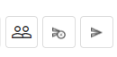

# ⏱️ Vencidos

En el menú Vencidos se presentan todos los documentos enviados por el usuario para firma, pero que no fueron completados dentro del plazo estipulado en el campo “**Tiempo para expiración del documento después del envío**”, en la pantalla&#x20;

[<mark style="color:blue;">Nuevo Documento > Agregar Documentos y Destinatarios > Configuraciones Avanzadas.</mark>](novo-documento.md#configuracoes-avancadas)

<figure><figcaption></figcaption></figure>

***

## Columnas de la pantalla principal – Vencidos&#x20;

<figure><figcaption></figcaption></figure>

**Columna Nombre del Documento:** En esta columna se muestran el nombre del documento y el nombre del firmante. Si hay más de un firmante, se mostrará el nombre del primero y la cantidad de otras personas que deben firmar. Todos los documentos listados exhibirán el mensaje "Vencido antes de la conclusión de las firmas".

<figure><figcaption></figcaption></figure>

**Columna Responsable:** En esta columna se presentan el nombre y el correo electrónico de quien envió el documento (remitente). En la pantalla de Vencidos, siempre se mostrará el nombre del propio usuario.

**Columna Estado:** Los documentos listados en la pantalla de Vencidos siempre tendrán el estado “Aguardando” (ningún participante ha firmado el documento hasta el momento) o “En proceso” (uno o más participantes ya han firmado el documento, pero aún faltan firmas). Al pasar el ratón sobre el estado, se muestran informaciones sobre qué firmantes aún tienen la firma pendiente y cuáles ya la han concluido, además de los datos de esos firmantes.

<figure><figcaption></figcaption></figure>

**Columna Tamaño:** En esta columna se muestra el tamaño del archivo del documento.

**Columna Carpeta:** En esta columna se indica la carpeta del directorio donde está almacenado el documento.

**Columna Enviado:** Información sobre la fecha y hora en que se envió el documento.

**Columna Vencimiento:** Información sobre la fecha y hora en que el documento expiró.

**Columna Acciones:** Esta columna muestra botones de acción sobre el documento. Estos botones se exhibirán de acuerdo con el perfil del usuario. Siempre se mostrará en este botón la acción prioritaria de ejecución, según el perfil del usuario y el estado del documento.

**Barra de Filtro:** Es posible localizar uno o más documentos utilizando los filtros disponibles para la búsqueda. La búsqueda se puede realizar por el nombre del documento, el nombre de los signatarios, el estado, la carpeta en la que está almacenado el documento o la fecha de vencimiento del documento.

<figure><figcaption></figcaption></figure>

***

## Acciones individuales – Vencidos&#x20;

<figure><figcaption>
Clique na imagem para ampliar.
</figcaption></figure>

#### **Reenviar**

Al hacer clic en este botón, se mostrarán las informaciones sobre el orden de envío a los destinatarios, el correo electrónico o teléfono al que se envió el documento, el código de seguridad para acceder al documento (si lo hay) y el ícono "Editar", que permite modificar la información del destinatario. Al reenviar un documento, este dejará de aparecer en la pantalla de Vencidos porque el plazo de expiración se renueva. &#x20;

<figure><figcaption></figcaption></figure>

#### Alterar Carpeta

Esta opción solo se mostrará si el usuario tiene acceso a la cuenta en la que está almacenado el documento. Al hacer clic en esta opción, podrá cambiar la carpeta del directorio donde está almacenado el documento. &#x20;

<figure><figcaption></figcaption></figure>

#### **Alterar Proprietario**

Al hacer clic en esta opción, podrá cambiar el propietario del documento. Al ejecutar esta acción, no será posible realizar otras actividades de gestión del documento.


<mark style="color:orange;">**Solo se pueden seleccionar como nuevos propietarios a usuarios registrados en la misma cuenta que el responsable.**</mark>


<figure><figcaption></figcaption></figure>

#### Descargar Archivo

&#x20;Cuando el proceso contiene un documento o es un intercambio de solo un documento del proceso, el sistema **descarga** el documento del **proceso y el registro de firmas** en una carpeta .zip.

La carpeta .zip se nombra con el nombre del proceso y el archivo de registro de firmas se nombra como **NombreDocumento\_Registro** de firma.

<figure><figcaption></figcaption></figure>

Cuando el proceso **contenga más de un documento**, el sistema muestra un modal con los documentos del proceso para que el usuario seleccione cuáles documentos desea descargar. En el caso de un intercambio, solo deben listarse los documentos que han sido compartidos.

<figure><figcaption></figcaption></figure>

El Registro de Firmas muestra toda la información sobre las firmas electrónicas y digitales realizadas durante el proceso, como el nombre de los firmantes, la fecha y hora de la firma, la ubicación, la IP desde donde se realizó, los datos de los certificados digitales utilizados, etc.

<figure><figcaption></figcaption></figure>

<figure><figcaption></figcaption></figure>

#### **Cancelar**

Al hacer clic en esta opción, el documento se cancela y el proceso de firmas se interrumpe.

<figure><figcaption></figcaption></figure>

#### **Histórico**

Utilizado para visualizar información sobre el documento y el historial de eventos relacionados con él. También es posible descargar los archivos originales del proceso, antes de que se completaran las firmas.

Con el botón de eventos ubicado a la derecha, se pueden observar los datos del proceso en la pantalla.

<figure><figcaption></figcaption></figure>

Con el botón de eventos ubicado a la izquierda, es posible visualizar los ID y Hash de los documentos, en el caso de un **proceso con más de un documento no agrupado**.

<figure><figcaption></figcaption></figure>

***

## Acciones en lote – Vencidos.

Es posible seleccionar más de un documento marcando las casillas de verificación al lado del nombre del archivo y ejecutar acciones en lote.

<figure><figcaption>
Haz clic en la imagen para ampliar.
</figcaption></figure>

#### **Alterar Proprietario**

Al hacer clic en esta opción, será posible cambiar el propietario del documento. Al ejecutar esta acción, no se podrán realizar otras actividades de gestión del documento. &#x20;


<mark style="color:orange;">**Solo pueden ser seleccionados como nuevos propietarios usuarios registrados en la misma cuenta del responsable.**</mark>&#x20;


<figure><figcaption></figcaption></figure>

#### **Cancelar Envío**

Al hacer clic en este ícono, será posible cancelar el envío de los documentos seleccionados, interrumpiendo así los procesos de firma.

<figure><figcaption></figcaption></figure>

#### **Reenviar**

Al hacer clic en este ícono, será posible reenviar los documentos seleccionados a los destinatarios que aún no han firmado. Al reenviar un documento, deja de mostrarse en la pantalla de Vencidos porque se renueva el plazo de expiración.&#x20;

<figure><figcaption></figcaption></figure>
