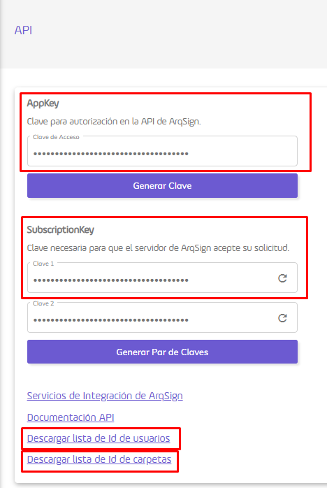

# 🟪 ArqSign y Clínica nas Nuvens

Quiero integrar mi cuenta de <strong>“Clinica nas Nuvens”</strong> con la <strong>Plataforma ArqSign</strong> para la firma digital de documentos. ¿Cómo debo proceder?

Gracias a la alianza entre Clínica nas Nuvens y ArqSign, las soluciones se conectan automáticamente, solo debes seguir los siguientes pasos:

1. Activa tu cuenta en Clínica nas Nuvens;
2. Accede a la página de compra de la [Plataforma ArqSign](https://arquivar.com.br/arqsign/);
3. Elige tu plan y completa la adquisición;
4. Inicia sesión en la solución ArqSign;
5. En la cuenta de ArqSign, accede al menú **“Integraciones” > Api** para obtener la información que necesitas ingresar en Clínica nas Nuvens;
6. La información que debes ingresar en Clínica nas Nuvens es:

a. AppKey

b. SubscriptionKey

c. ID de Usuario

d. ID de Carpeta

Debes obtener esta información en los siguientes lugares:

e.

 

7. En tu cuenta de **Clínica nas Nuvens**, accede al menú **Configuraciones > Mi Empresa > Integraciones > Firma Digital**, ingresa la información solicitada y haz clic en **Guardar**.
8. ¡Listo! ¡Las soluciones ya están conectadas! Ahora solo tienes que enviar los documentos para firma y, una vez completados, estarán disponibles en ambos sistemas — **ArqSign y Clínica nas Nuvens** — además de ser enviados a tu cliente o paciente.
9. Para más detalles sobre cómo utilizar la herramienta en Clínica nas Nuvens, accede al artículo sobre el [funcionamiento de la firma digital](https://intercom.help/clinicanasnuvens/pt-BR/articles/8486062-assinatura-digital-como-funciona).

